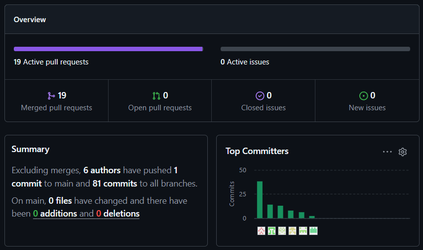
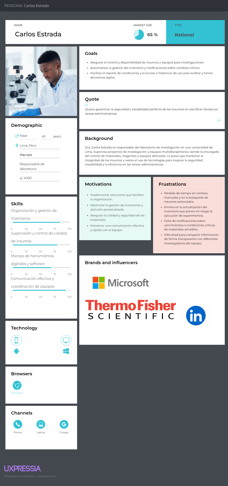
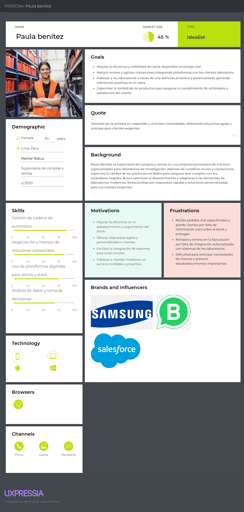
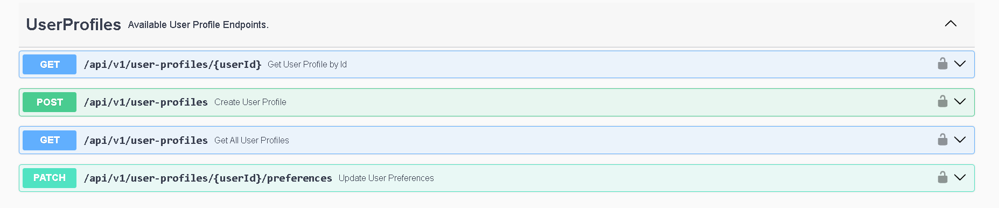
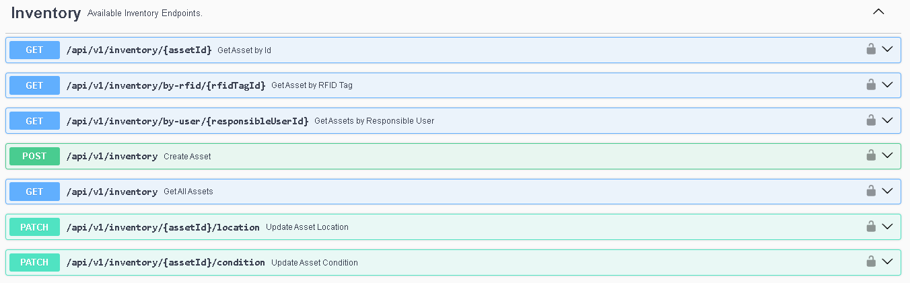

<div align = "center">
  
  <h1>Universidad Peruana de Ciencias Aplicadas</h1>
  <h2>Carrera: de Ingeniería de Software</h2>
  <h2>Ciclo: 2025-02</h2>
  <h2>1ASI0730 - Aplicaciones Web </h2>
  <h2>NRC: 7454</h2>
  <br>
  <h2>Profesor: Angel Augusto Velasquez Nuñez </h2>
  <h2>Informe de Trabajo Final</h2>
  <br>
  <h2 >Startup: ASSIDUOU SOFTWARE </h2>
  <h2 >Producto: LabIoT</h2>
  <br>
  <h2 >Integrantes:</h2>
  <ul style="list-style: none; padding: 0;">
      <li><h3>Navarro Chang Alicia Avril - u20231d637 </h3></li>
      <li><h3>Alexander Auden Aliaga Ocampo- U202417693</h3></li>
      <li><h3>Andre Pillaca Velasquez - U202022056</h3></li>
      <li><h3>Mazuelos Callirgos Marcelo Alessandro – u201916143</h3></li>
      <li><h3>Huanca Zevallos, Cristhian Joel - u20201b914</h3></li>
      <li><h3>Alcantara Baldeonn, Poly Gabriel - u202418250</h3></li>
  </ul>
  <br>
  <h4>Septiembre del 2025</h4>
<br>
</div>

## Registro de Versiones del Informe

| Versión | Fecha      | Autor                                            | Descripción de modificación |
|---------|------------|--------------------------------------------------|-----------------------------|
| 1.0     | 21/09/2025 | Todos los integrantes                            | Primer sprint TB1           |
| 1.1     | 09/10/2025 | Todos los integrantes                            | Segundo sprint TP           |

## Project Report Collaboration Insights
| URL de la organización del proyecto |   URL del repositorio del reporte   |            URL del Fronted Web Application            |
|:-----------------------------------:|:-----------------------------------:|:-----------------------------------------------------:|
|   https://github.com/Los-Bytes      | https://github.com/Los-Bytes/Report | https://github.com/Los-Bytes/FrontendWebApplications  |

|           URL del Landing Page            |            URL del deployment del Landing Page            |
|:-----------------------------------------:|:-----------------------------------------------------:|
| https://github.com/MarceloMazuelos/LabIoT-Landing-Page/  | https://marcelomazuelos.github.io/LabIoT-Landing-Page/  |

### Entrega TB1

| Insights Report                                                                      | Insights Landing Page                                                                      |
|--------------------------------------------------------------------------------------|--------------------------------------------------------------------------------------------|
|  |  |

---

### Entrega TP

| Insights Report                                                                      | Insights Landing Page                                                                      | Insights FrontEnd                                                                      |
|--------------------------------------------------------------------------------------|--------------------------------------------------------------------------------------------|----------------------------------------------------------------------------------------|
|  |  |  |

---


## Contenido

- [Student Outcome](#student-outcome)

- [Capítulo I: Introducción](#cap1)
    - [1.1. Startup Profile](#11-startup-profile)
        - [1.1.1. Descripción de la Startup](#111-descripción-de-la-startup)
        - [1.1.2. Perfiles de integrantes del equipo](#112-perfiles-de-integrantes-del-equipo)
    - [1.2. Solution Profile](#12-solution-profile)
        - [1.2.1 Antecedentes y problemática](#121-antecedentes-y-problemática)
        - [1.2.2 Lean UX Process](#122-lean-ux-process)
            - [1.2.2.1. Lean UX Problem Statements](#1221-lean-ux-problem-statements)
            - [1.2.2.2. Lean UX Assumptions](#1222-lean-ux-assumptions)
            - [1.2.2.3. Lean UX Hypothesis Statements](#1223-lean-ux-hypothesis-statements)
            - [1.2.2.4. Lean UX Canvas](#1224-lean-ux-canvas)
    - [1.3. Segmentos objetivo](#13-segmentos-objetivo)

- [Capítulo II: Requirements Elicitation & Analysis](#cap2)
    - [2.1. Competidores](#21-competidores)
        - [2.1.1. Análisis competitivo](#211-análisis-competitivo)
        - [2.1.2. Estrategias y tácticas frente a competidores](#212-estrategias-y-tácticas-frente-a-competidores)
    - [2.2. Entrevistas](#22-entrevistas)
        - [2.2.1. Diseño de entrevistas](#221-diseño-de-entrevistas)
        - [2.2.2. Registro de entrevistas](#222-registro-de-entrevistas)
        - [2.2.3. Análisis de entrevistas](#223-análisis-de-entrevistas)
    - [2.3. Needfinding](#23-needfinding)
        - [2.3.1. User Personas](#231-user-personas)
        - [2.3.2. User Task Matrix](#232-user-task-matrix)
        - [2.3.3. User Journey Mapping](#233-user-journey-mapping)
        - [2.3.4. Empathy Mapping](#234-empathy-mapping)
    - [2.4. Big Picture EventStorming](#24-big-picture-eventstorming)
    - [2.5. Ubiquitous Language](#25-ubiquitous-language)


- [Capítulo III: Requirements Specification](#cap3)
    - [3.1. User Stories](#31-user-stories)
    - [3.2. Impact Mapping](#32-impact-mapping)
    - [3.3. Product Backlog](#33-product-backlog)


- [Capítulo IV: Product Design](#cap4)
    - [4.1. Style Guidelines](#41-style-guidelines)
        - [4.1.1. General Style Guidelines](#411-general-style-guidelines)
        - [4.1.2. Web Style Guidelines](#412-web-style-guidelines)
    - [4.2. Information Architecture](#42-information-architecture)
        - [4.2.1. Organization Systems](#421-organization-systems)
        - [4.2.2. Labeling Systems](#422-labeling-systems)
        - [4.2.3. SEO Tags and Meta Tags](#423-seo-tags-and-meta-tags)
        - [4.2.4. Searching Systems](#424-searching-systems)
        - [4.2.5. Navigation Systems](#425-navigation-systems)
    - [4.3. Landing Page UI Design](#43-landing-page-ui-design)
        - [4.3.1. Landing Page Wireframe](#431-landing-page-wireframe)
        - [4.3.2. Landing Page Mock-up](#432-landing-page-mock-up)
    - [4.4. Web Applications UX/UI Design](#44-web-applications-uxui-design)
        - [4.4.1. Web Applications Wireframes](#441-web-applications-wireframes)
        - [4.4.2. Web Applications Wireflow Diagrams](#442-web-applications-wireflow-diagrams)
        - [4.4.3. Web Applications Mock-ups](#443-web-applications-mock-ups)
        - [4.4.4. Web Applications User Flow Diagrams](#444-web-applications-user-flow-diagrams)
    - [4.5. Web Applications Prototyping](#45-web-applications-prototyping)
    - [4.6. Domain-Driven Software Architecture](#46-domain-driven-software-architecture)
        - [4.6.1. Design-Level EventStorming](#461-design-level-eventstorming)
        - [4.6.2. Software Architecture Context Diagram](#462-software-architecture-context-diagram)
        - [4.6.3. Software Architecture Container Diagrams](#463-software-architecture-container-diagrams)
        - [4.6.4. Software Architecture Components Diagrams](#464-software-architecture-components-diagrams)
    - [4.7. Software Object-Oriented Design](#47-software-object-oriented-design)
        - [4.7.1. Class Diagrams](#471-class-diagrams)
    - [4.8. Database Design](#48-database-design)
        - [4.8.1. Database Diagram](#481-database-diagram)


- [Capítulo V: Product Implementation, Validation & Deployment](#cap5)
    - [5.1. Software Configuration Management](#51-software-configuration-management)
        - [5.1.1. Software Development Environment Configuration](#511-software-development-environment-configuration)
        - [5.1.2. Source Code Management](#512-source-code-management)
        - [5.1.3. Source Code Style Guide & Conventions](#513-source-code-style-guide--conventions)
        - [5.1.4. Software Deployment Configuration](#514-software-deployment-configuration)
    - [5.2. Landing Page, Services & Applications Implementation](#52-landing-page-services--applications-implementation)
        - [5.2.1. Sprint 1](#521-sprint-1)
            - [5.2.1.1. Sprint Planning 1](#5211-sprint-planning-1)
            - [5.2.1.2. Aspect Leaders and Collaborators](#5212-aspect-leaders-and-collaborators)
            - [5.2.1.3. Sprint Backlog 1](#5213-sprint-backlog-1)
            - [5.2.1.4. Development Evidence for Sprint Review](#5214-development-evidence-for-sprint-review)
            - [5.2.1.5. Execution Evidence for Sprint Review](#5215-execution-evidence-for-sprint-review)
            - [5.2.1.6. Services Documentation Evidence for Sprint Review](#5216-services-documentation-evidence-for-sprint-review)
            - [5.2.1.7. Software Deployment Evidence for Sprint Review](#5217-software-deployment-evidence-for-sprint-review)
            - [5.2.1.8. Team Collaboration Insights during Sprint](#5218-team-collaboration-insights-during-sprint)
          - [5.2.2. Sprint 2](#522-sprint-2)
            - [5.2.2.1. Sprint Planning 2](#5221-sprint-planning-2)
            - [5.2.2.2. Aspect Leaders and Collaborators](#5222-aspect-leaders-and-collaborators)
            - [5.2.2.3. Sprint Backlog 2](#5223-sprint-backlog-2)
            - [5.2.2.4. Development Evidence for Sprint Review](#5224-development-evidence-for-sprint-review)
            - [5.2.2.5. Execution Evidence for Sprint Review](#5225-execution-evidence-for-sprint-review)
            - [5.2.2.6. Services Documentation Evidence for Sprint Review](#5226-services-documentation-evidence-for-sprint-review)
            - [5.2.2.7. Software Deployment Evidence for Sprint Review](#5227-software-deployment-evidence-for-sprint-review)
            - [5.2.2.8. Team Collaboration Insights during Sprint](#5228-team-collaboration-insights-during-sprint)

- [Conclusiones](#conclusiones)
- [Bibliografía](#bibliografía)
- [Anexos](#anexos)

## Student Outcome

El curso contribuye al cumplimiento del Student Outcome ABET:

**ABET – EAC - Student Outcome 5**

**Criterio:** : La capacidad de funcionar efectivamente en un equipo cuyos miembros
juntos proporcionan liderazgo, crean un entorno de colaboración e inclusivo,
establecen objetivos, planifican tareas y cumplen objetivos.
En el siguiente cuadro se describe las acciones realizadas y enunciados de
conclusiones por parte del grupo, que permiten sustentar el haber alcanzado el logro
del ABET – EAC - Student Outcome 5.

<table>
  <tr>
    <th>Criterio específico</th>
    <th>Acciones realizadas</th>
    <th>Conclusiones</th>
  </tr>
  <tr>
    <td>Trabaja en equipo para proporcionar liderazgo en forma conjunta.</td>
    <td>
    Cristhian Joel Huanca Zevallos  
    <br> TB1: Colaboré en la guía de estilos, el diagrama de base de datos, los antecedentes y el impact mapping, guiando al equipo hacia un estándar común y una visión compartida.
    <br> TP: Colaboré activamente en el desarrollo del bounded context de User Profile, coordinando con el equipo las decisiones de diseño y la integración del frontend, brindando liderazgo técnico y apoyo en la resolución de incidencias durante el desarrollo.
    <br><br>
    Gabriel Alcantara Baldeon  
    <br> TB1: Añadí y desarrollé la sección Lean UX Canvas, la Estrategias y tácticas frente a competidores, y las secciones Labeling Systems, SEO Tags and Meta Tags, y Searching Systems, asegurando coherencia y estandarización con el resto del documento.
    <br><br>
    Marcelo Alessandro Mazuelos Callirgos  
    <br> TB1: Colaboré en la guía de estilos, el diagrama de base de datos, los antecedentes y el impact mapping, guiando al equipo hacia un estándar común y una visión compartida.
    <br> TP: Colaboré en determinar los errores del reporte y fomenté la colaboración de todos en forma de solucionarlo en grupo.
    <br><br>
    Alicia Navarro  
    <br> TB1: Realicé aportes sobre el capítulo 2, las user stories y epics, y colaboré activamente en el evento de event storming compartiendo hallazgos y estructurando el flujo de eventos del sistema.
    <br> TP1: Me encargué de las correcciones faltantes de la entrega anterior relacionadas con el capítulo 3, el diagrama de clases y la documentación, y desarrollé el bounded context de Subscription Management consolidando reglas, vocabulario y entidades del subdominio.
    </td>
    <td>El liderazgo conjunto fortaleció la cohesión del grupo y permitió tomar decisiones claras en cada entregable.<br><br>
    La integración de estas secciones permitió un documento más estructurado y consistente, fortaleciendo el liderazgo compartido en la elaboración del informe.</td>
  </tr>
  <tr>
    <td>Crea un entorno colaborativo e inclusivo, establece metas, planifica tareas y cumple objetivos.</td>
    <td>
    Cristhian Joel Huanca Zevallos  
    <br> TB1: Integré aportes del equipo en la guía de estilos, base de datos, antecedentes e impact mapping, estableciendo metas claras y fomentando la participación.
    <br> TP: Participé en la planificación de tareas y metas del proyecto, apoyando en las actualizaciones del report y fomentando un ambiente colaborativo para cumplir con los entregables del equipo de forma organizada y efectiva.
    <br><br>
    Gabriel Alcantara Baldeon  
    <br> TB1: Complementé y unifiqué la redacción de nuevas secciones (Lean UX Canvas, estrategias frente a competidores, sistemas de etiquetado y SEO), alineándolas con los entregables previos del equipo y fomentando la continuidad del proyecto.
    <br><br>
    Marcelo Alessandro Mazuelos Callirgos  
    <br> TB1: Colaboré en partes de los diferentes capítulos del informe, sobre todo tomando la directiva en en Lean UX Assumptions, Identificación de competidores, su analisis y estrategias ante ellos; en la creación de los user stories, elaboración del Information Architecture, así como la elaboración de los Wireframe y los Mock-Ups de la landing page. Y realicé la elaboración del capítulo 5 y de la Landing Page.
    <br> TP: Realicé el desarrollo del bounded context de Laboratory Inventory Management.
    <br><br>
    Alicia Navarro  
    <br> TB1: Participé en la especificación de user stories, epics y el event storming, aportando sugerencias y validando los objetivos colaborativos del equipo en la documentación de requisitos.
    <br> TP1: Colaboré en las actividades de ajustes y correcciones de la documentación, diagramas y capítulos, ayudando a planificar entregables y evaluar el avance en el desarrollo de todo el bounded context de Subscription Management.
    </td>
    <td>El trabajo colaborativo facilitó cumplir los objetivos en los plazos y consolidó un entorno inclusivo y organizado.<br><br>
    El trabajo organizado y la integración de mis aportes facilitaron cumplir con los objetivos planteados, garantizando un entorno colaborativo donde cada aporte reforzó el producto final.</td>
  </tr>
</table>


## Capítulo 1: Introducción
### 1.1. Startup Profile
#### 1.1.1. Descripción del Startup
Somos Los Bytes, un grupo de estudiantes de Ingeniería de Software de la Universidad Peruana de Ciencias Aplicadas (UPC) comprometidos con el desarrollo de soluciones tecnológicas innovadoras que aporten valor y eficiencia al sector científico. En el marco de nuestra formación académica, hemos emprendido la creación de una Startup enfocada en transformar la gestión de inventarios en laboratorios a través del uso de tecnologías inteligentes como el Internet de las Cosas (IoT), RFID y sensores inteligentes, combinando innovación, precisión y automatización.

Misión:</br>
Nuestra misión es mejorar la gestión y seguridad en laboratorios de investigación y empresas proveedoras, facilitando el monitoreo proactivo y la eficiencia mediante tecnologías inteligentes como IoT, RFID y códigos QR. Queremos eliminar tareas tediosas y minimizar riesgos asociados al manejo de materiales críticos.

Visión:</br>
Nuestra visión es convertirnos en un startup referente en soluciones tecnológicas para gestión inteligente de inventarios en laboratorios, promoviendo entornos más seguros, eficientes y confiables para la investigación científica y la comercialización de insumos, tanto en Perú como en otros mercados emergentes.

#### 1.1.2. Perfiles de integrantes del equipo
<table>
  <tr>
    <th colspan="2"> Alicia Avril Navarro Chang </th>
  </tr>
  <tr>
    <td>  </td>
    <td> Soy estudiante de Ingeniería de Software en la UPC, con conocimientos básicos en programación en C++ y Python, fundamentos en bases de datos, diseño y modelado de software utilizando UML y diagramas, así como algoritmos y estructuras de datos básicos. Además, poseo habilidades de empatía y comunicación efectiva que me permiten colaborar de manera eficiente en equipo, facilitando la comunicación clara y asertiva para contribuir a un entorno de trabajo productivo y colaborativo. </td>
  </tr>
  <tr>
    <th colspan="2"> Alexander Auden Aliaga Ocampo </th>
  </tr>
  <tr>
    <td>  </td>
    <td> Soy estudiante de ingeniería de software en la UPC, con conocimientos básicos en los lenguajes de programación como c++, python , css, html, javascript también conocimientos básicos en base de datos viendo Mongo DB y creando diagramas relaciones como no relacionales. Además poseo habilidades de empatía y buena comunicación con el equipo esto me permite ser productivo en el ámbito de grupos y en general. </td>
  </tr>

<tr>
    <th colspan="2"> Cristhian Joel Huanca Zevallos </th>
  </tr>
  <tr>
    <td>  </td>
    <td> Soy estudiante de ingeniería de software en la UPC,  me considero una persona proactiva, organizada y responsable al momento de desarrollar un nuevo proyecto en mi vida. En un grupo de trabajo siempre trato de respetar las opiniones de los demás, trato de entender los demás puntos de vista y animo a estar en unión frente a un problema.  </td>
  </tr>

 <tr>
    <th colspan="2">Marcelo Alessandro Mazuelos Callirgos</th>
  </tr>
  <tr>
    <td> 
    <td> Soy estudiante de Ingeniería de Software, interesado en el desarrollo de aplicaciones y en la creación de soluciones tecnológicas innovadoras. Me caracterizo por mi interés en el aprendizaje continuo con el objetivo de seguir creciendo profesionalmente y aportar valor en el área de la tecnología.</td>
  </tr>
</table>

### 1.2. Solution Profile
#### 1.2.1. Antecedentes y problemática

A. **Who**

Los principales actores son los laboratorios de investigación, los técnicos de laboratorio, investigadores, oficiales de seguridad,
así como las empresas proveedoras de insumos científicos. Todos ellos enfrentan dificultades en la gestión de inventarios por
depender de procesos manuales y poco confiables.

B. **What**

Actualmente, la gestión de inventarios en los laboratorios se realiza mediante conteos manuales y registros dispersos, lo que
genera errores, pérdida de materiales, incumplimiento de normativas de seguridad, interrupciones en experimentos y mayores costos
operativos. Además, no existen mecanismos de monitoreo en tiempo real para verificar condiciones críticas como temperatura,
humedad o caducidad de insumos.

C. **When**

Estos problemas se presentan en el día a día de las operaciones de los laboratorios y proveedores, desde el registro de entrada
y salida de materiales hasta la preparación de pedidos, auditorías, y ejecución de experimentos. Los riesgos aumentan en
momentos críticos como inspecciones, ensayos experimentales y entregas de insumos sensibles.

D. **Where**

La problemática ocurre tanto dentro de los laboratorios de investigación y universidades como en las empresas proveedoras y
almacenes de insumos científicos. En ambos entornos, los procesos carecen de visibilidad, trazabilidad y control automatizado.

E. **Why**

Porque la ausencia de automatización y monitoreo genera:

- Pérdida de trazabilidad de insumos críticos.

- Mayor riesgo de accidentes o incumplimiento normativo.

- Errores en entregas y devoluciones entre proveedores y clientes.

- Desperdicio de tiempo y recursos humanos en tareas repetitivas.
  Esto impacta directamente en la seguridad, la confiabilidad de los experimentos y la eficiencia operativa.

F. **How**

Muchos laboratorios utilizan hojas de cálculo, sistemas ERP genéricos o plataformas de gestión básica. Sin embargo, estas
soluciones no ofrecen integración con IoT (RFID, QR, sensores inteligentes) ni un monitoreo automatizado en tiempo real,
por lo que los problemas persisten.

G. **How much**

El impacto se refleja en:

- Más del 70% del tiempo de los responsables de inventarios invertido en tareas manuales.

- Errores superiores al 30–40% en registros y control de stock.

- Pérdida económica significativa por caducidad o mal almacenamiento de insumos sensibles.

- Alta fricción comercial entre proveedores y laboratorios debido a errores en entregas y devoluciones.

#### 1.2.2. Lean UX Process
##### 1.2.2.1. Lean UX Problem Statements
### Segmento — Investigadores Líderes / Responsables de Laboratorios de Investigación

**Contexto:** Dirigen proyectos, supervisan equipos y toman decisiones sobre la compra y uso de insumos especializados; necesitan garantizar continuidad experimental y cumplimiento normativo.

**Observación:** La gestión actual de insumos y condiciones de almacenamiento (temperatura, humedad, fechas de caducidad) suele ser manual y fragmentada (hojas, registros locales), lo que provoca pérdidas de reactivos, retrasos en ensayos y decisiones de compra reactivas.

**Problema:** No existe una herramienta que ofrezca visibilidad en tiempo real, trazabilidad y alertas accionables adaptadas al flujo de trabajo de un laboratorio de investigación sin añadir carga administrativa al equipo.

**Pregunta clave:** ¿Cómo diseñar una solución (QR/RFID + sensores + panel operativo) que permita a los investigadores líderes monitorear el estado de insumos y condiciones ambientales, recibir alertas priorizadas y generar evidencia auditable para toma de decisiones y compras oportunas?


### Segmento — Supervisores Comerciales / Jefes de Compras en Empresas Proveedoras de Insumos

**Contexto:** Coordinan ventas y logística, mantienen la relación con laboratorios y responden a incidencias en entregas; buscan reducir reclamaciones y optimizar la cadena de suministro.

**Observación:** La falta de un flujo estandarizado de identificación y registro (etiquetado, estado en tránsito, verificación a la recepción) genera errores, devoluciones y fricción comercial que aumentan costos operativos.

**Problema:** No hay un mecanismo compartido, sencillo y confiable entre proveedor y laboratorio que permita verificar condiciones de transporte, estado del pedido y recepción confirmada en tiempo real.

**Pregunta clave:** ¿Cómo implementar un flujo de trazabilidad colaborativo (etiquetas QR/RFID, eventos de transporte y notificaciones integradas) que permita a supervisores comerciales y jefes de compras reducir errores, acelerar validaciones y mejorar la experiencia de entrega para los laboratorios?
##### 1.2.2.2. Lean UX Assumptions
###### Supuestos sobre los usuarios de la aplicación:

- Los responsables de laboratorios necesitan llevar un control y una constante actualización del inventario de materiales.
- Los responsables de compras y proveedores de insumos requieren trazabilidad y seguridad en la entrega de materiales para evitar reclamos o pérdidas.
- Los usuarios necesitan interfaces simples que muestren de forma clara la información mostrada del estado del inventario y las alertas críticas.
- Los usuarios están dispuestos a adoptar tecnología IoT (sensores, RFID, QR) siempre que el retorno de inversión sea claro.

###### Supuestos sobre necesidades

- El conteo manual de insumos en laboratorios es un proceso tedioso y propenso a errores.
- Existen riesgos asociados a la pérdida, caducidad o mal almacenamiento de productos (temperatura, humedad).
- Una solución que automatice y genere alertas en tiempo real resolverá estos problemas de seguridad y control.
- La integración con sistemas de gestión ya existentes (ERP, software de compras) es un requerimiento importante.

###### Supuestos sobre la solución

- El uso de RFID y códigos QR facilita la identificación de insumos de manera rápida y confiable.
- Los sensores inteligentes permiten monitorear condiciones críticas (ej. temperatura de reactivos) y evitar pérdidas.
- Una plataforma centralizada basada en web permitirá a los laboratorios controlar en tiempo real su inventario desde cualquier lugar.
- El sistema puede escalarse desde un pequeño laboratorio hasta grandes instalaciones de investigación o distribución.

###### Supuestos sobre el impacto

- La solución reducirá el tiempo destinado a tareas de inventario manual.
- Disminuirá la pérdida de insumos por mal almacenamiento o caducidad.
- Mejorará la seguridad y trazabilidad, cumpliendo normativas de laboratorios certificados.
- Permitirá a las empresas proveedoras de insumos demostrar valor agregado en sus servicios.

##### 1.2.2.3. Lean UX Hyphotesis Statements

### 1.3 Segmentos Objetivo
### Segmento objetivo #1: Investigadores líderes o responsables de laboratorios de investigación  
Este grupo está conformado por profesionales que dirigen o coordinan laboratorios en instituciones académicas, científicas o tecnológicas. Su función involucra la supervisión de equipos de trabajo, la gestión de insumos y equipos especializados, y la toma de decisiones en torno a la compra y uso de materiales necesarios para el desarrollo de proyectos de investigación.

**Características clave de este segmento:**  
- Buscan optimizar la gestión y control de inventarios para evitar pérdidas o interrupciones en sus proyectos.  
- Valoran sistemas que mejoren la precisión y eficiencia en el seguimiento de insumos.  
- Requieren soluciones tecnológicas que garanticen integridad y trazabilidad en los materiales utilizados.  
- Se interesan por herramientas que reduzcan el tiempo dedicado a tareas administrativas.

---

### Segmento objetivo #2: Supervisores comerciales o jefes de compras en empresas proveedoras de insumos de laboratorio  
Este grupo está conformado por profesionales encargados de gestionar el abastecimiento, la relación con clientes institucionales y la negociación con proveedores de equipos e insumos científicos. Su labor se centra en asegurar la disponibilidad, calidad y entrega oportuna de materiales a los laboratorios.

**Características clave de este segmento:**  
- Buscan sistemas que mejoren la trazabilidad y control de los productos entregados a sus clientes.  
- Valoran la automatización y precisión en el monitoreo del stock.  
- Necesitan información en tiempo real para optimizar la cadena de suministro.  
- Se interesan por plataformas que faciliten la comunicación y el cumplimiento de requerimientos de los laboratorios.

## Capítulo II: Requirements Elicitation & Analysis
### 2.1. Competidores
#### 2.1.1. Análisis competitivo
##### Competidores directos:
- **Labguru**: plataforma de gestión de inventario y datos de laboratorio, con módulos para trazabilidad.
- **Quartzy**: software de gestión de inventario y pedidos para laboratorios de investigación.
- **LabCollector**: sistema modular que gestiona inventarios, muestras y equipos de laboratorio.

##### Competidores indirectos:
- **ERP tradicionales** como SAP o Odoo, que incluyen módulos de inventario, pero no especializados en laboratorios.
- **Sistemas de monitoreo IoT genéricos**, que no están centrados en laboratorios, pero pueden adaptarse.
- **Excel u hojas de cálculo** (competencia informal, pero todavía muy utilizada en laboratorios pequeños).

| Criterio | Labguru | Quartzy | LabColector | ERP(SAP/Odoo) | LabIoT |
|---|---|---|---|---|---|
| Inventario especializado en laboratorios | Si | Si | Si | No | No |
| Uso de IoT(Sensores,RFID,QR) | No | No | Limitado | No | Si |
| Alertas en tiempo real(temperatura,caducidad) | No | No | Parcial | No | No |
| Escabilidad para distintos tamaÑos de laboratorios | Si | Si | Si | Si | Si |

#### 2.1.2. Estrategias y tácticas frente a competidores
**Perfil**

El análisis competitivo permitió identificar que los principales competidores (Labguru, Quartzy y LabCollector) ofrecen soluciones sólidas de gestión de inventarios, pero carecen de integración con tecnologías IoT y monitoreo en tiempo real.

Frente a ello, **LabIoT** plantea las siguientes estrategias y tácticas:

**Estrategias**

1. **Diferenciación tecnológica**

- Potenciar la integración de IoT (sensores, RFID, QR) para garantizar monitoreo en tiempo real y trazabilidad completa.
- Incorporar alertas automáticas y registros auditables que los competidores no ofrecen.

2. **Especialización de nicho**

- Foco exclusivo en laboratorios de investigación, universidades y proveedores de insumos.
- Cumplir y superar normativas de seguridad y trazabilidad propias del sector científico.

3. **Accesibilidad y escalabilidad**

- Ofrecer versiones básicas a laboratorios pequeños y módulos premium a grandes instituciones.
- Implementar una estrategia de precios competitiva frente a plataformas internacionales.

4. **Alianzas estratégicas con proveedores**

- Crear sinergias con distribuidores de insumos para incluir la trazabilidad desde el origen hasta la entrega.
- Posicionarse como un puente de confianza entre proveedor y cliente.

5. **Posicionamiento de marca**

- Consolidar a LabIoT como un “laboratorio inteligente y seguro” que combina innovación, eficiencia y seguridad.

**Tácticas**

- Implementar pilotos gratuitos en laboratorios pequeños para validar el valor agregado y generar casos de éxito.
- Desarrollar módulos personalizables (inventario básico, monitoreo avanzado, reportes de auditoría, integración ERP).
- Aplicar estrategias de marketing digital enfocadas en beneficios medibles (ahorro de tiempo, reducción de errores, cumplimiento normativo).
- Establecer alianzas B2B con proveedores de insumos, integrando QR/RFID en la cadena de suministro.
- Mantener precios competitivos con planes accesibles y escalables.
- Brindar soporte especializado y capacitación para reducir la resistencia al cambio tecnológico.
### 2.2. Entrevistas
#### 2.2.1. Diseño de entrevistas
Segmento 1: Laboratorios de investigación 

¿Cómo gestionan actualmente el inventario de insumos y materiales en su laboratorio? 

¿Qué dificultades enfrentan con el conteo manual o el control manual del inventario? 

¿Cuáles son los riesgos o problemas asociados a errores en el manejo del inventario? 

¿Qué tipo de artículos o materiales requieren monitoreo especial (p.ej. temperatura, humedad)? 

¿Qué importancia tiene para ustedes la automatización y el monitoreo en tiempo real del inventario? 

¿Han utilizado antes tecnologías como RFID, códigos QR o sensores inteligentes en su gestión? 

¿Qué funcionalidades considerarían imprescindibles en una plataforma como LabioT? 

¿Qué tipo de alertas o notificaciones serían útiles para un monitoreo eficiente? 

¿Cuáles son las normativas o medidas de seguridad que deben cumplir y cómo afectan su gestión de inventarios? 

¿Qué expectativas tienen sobre la integración de tecnologías IoT en su flujo de trabajo diario? 

 

Segmento 2: Empresas proveedoras de insumos y materiales para laboratorios 

¿Cómo realizan el seguimiento y control de los productos que distribuyen a laboratorios? 

¿Qué desafíos encuentran en asegurar la correcta identificación y estado de los productos durante su almacenamiento y envío? 

¿Actualmente utilizan etiquetas RFID, códigos QR o tecnologías similares para la gestión de inventarios? 

¿Qué importancia tiene para su empresa garantizar que los productos cumplan con las medidas de seguridad exigidas por laboratorios? 

¿Qué retos enfrentan para escalar o automatizar el control de inventarios? 

¿Qué funcionalidades desearían que una plataforma de gestión de inventarios IoT les ofreciera? 

¿Cómo manejan las alertas relacionadas con condiciones críticas como temperatura o almacenamiento inadecuado? 

¿Qué tipo de reportes o información en tiempo real necesitan para tomar decisiones operativas? 

¿Cuáles son las expectativas sobre la integración de sistemas IoT para mejorar la eficiencia y seguridad en sus procesos? 

¿Qué apoyo o capacitación consideran necesario para adoptar una solución tecnológica como LabioT? 
#### 2.2.2. Registro de entrevistas
En esta sección, el equipo hace entrevistas a personas pertenecientes a los segmentos respectivos.
##### *Segemento 1: Laboratorios de investigación y Investigadores responsables de laboratorios*
###### Entrevista 1: Investigadores responsables de laboratorios

<table border=1>
  <tr>
    <td>
      <b>Nombres y apellidos:</b> Alfonso Chang <br>
      <b>Edad: </b> 50 años <br>
      <b>Distrito:</b> San Miguel <br>
      <b>Ocupacion:</b> Investigador jefe retirado de laboratorio de SENASA <br>
      <b>Timing:</b> 0:00 minutos <br>
      <b>Duración:</b> 10:04 minutos
    </td>
    <td align=center>
      
    </td>
  </tr>
  <tr>
    <td colspan=2>
      <b>Enlace:</b> <a href="https://upcedupe-my.sharepoint.com/:v:/g/personal/u20231d637_upc_edu_pe/EaFj2S5q7RtEtg_r7xd_4JEBZ4kbq9hYPrwAlS4cuNNKDQ?e=4ZYAAv"> Link </a>
      <br>
      <b>Resumen:</b> El investigador, con amplia experiencia en laboratorios de investigación agrícola, valora la integración de tecnologías IoT para modernizar la gestión de laboratorios. Destaca cómo el uso de códigos QR, sensores y dispositivos IoT permite monitorizar en tiempo real condiciones ambientales y procesos dentro del laboratorio, facilitando un control más preciso y confiable. Resalta que un sistema web centralizado para manejar estas tecnologías mejora la eficiencia operativa, reduce errores manuales y agiliza la toma de decisiones. También nos comenta que en su trabajo la mayoría de tareas que tengan que ver con gestión de inventarios o monitoreos generalmente siempre se hacían con herramientas básicas de ofimatica como excel y que los insumos siempre tienen que cumplir con estrictas medidas y reglas para controlar su calidad y evitar alteraciones en su composición.
    </td>
  </tr>
</table>

###### Entrevista 2:  Laboratorios de investigación

<table border=1>
  <tr>
    <td>
      <b>Nombres y apellidos:</b> Luana Huayanay  <br>
      <b>Edad: </b> 24 años <br>
      <b>Distrito:</b> San Miguel <br>
      <b>Ocupacion:</b> Practicante <br>
      <b>Timing:</b> 0:00 minutos <br>
      <b>Duración:</b> 07:56 minutos
    </td>
    <td align=center>
      
    </td>
  </tr>
  <tr>
    <td colspan=2>
      <b>Enlace:</b> <a href="https://upcedupe-my.sharepoint.com/personal/u202022056_upc_edu_pe/_layouts/15/stream.aspx?id=%2Fpersonal%2Fu202022056%5Fupc%5Fedu%5Fpe%2FDocuments%2FEntrevista%201%5F%20app%20web%20%E2%80%90%20Hecho%20con%20Clipchamp%2Emp4&nav=eyJyZWZlcnJhbEluZm8iOnsicmVmZXJyYWxBcHAiOiJPbmVEcml2ZUZvckJ1c2luZXNzIiwicmVmZXJyYWxBcHBQbGF0Zm9ybSI6IldlYiIsInJlZmVycmFsTW9kZSI6InZpZXciLCJyZWZlcnJhbFZpZXciOiJNeUZpbGVzTGlua0NvcHkifX0&ga=1&referrer=StreamWebApp%2EWeb&referrerScenario=AddressBarCopied%2Eview%2Ed2f63370%2D0166%2D4c43%2Dae85%2D4cb90ba0d12f"> Link </a>
      <br>
      <b>Resumen:</b> Luana nos comenta que la manera de como controla su registro es a través de Excel, además que al registrarlo de esta manera se pierde mucho tiempo, y que a veces se olvidan de registrar por lo que generar desorden y retrasos con las prácticas y experimentos que realizan.

También nos comentan las funciones que son necesarias para una plataforma como Labiot son tener un registró automático de entradas y salidas, tener un monitoreo de temperaturas, tener un historial de cada material. además, nos cuenta los tipos de notificaciones que necesita para tener un mayor control y monitoreo es saber la fecha de vencimiento de sus reactivos o medicamentos, también tener alertas ante cualquier variación en la temperatura parar sus congeladores, tener alertas para recordar revisar su inventario, saber con qué insumos están trabajando y para ver cuáles son los insumos que quedan disponibles, además de un aviso por si un refrigerador se abre fuera del horario autorizado.

Luana comento que las normativas que cumple es registrar todo los equipos y insumos, asegurar la conservación adecuada de sus materiales.

Luana resalta que las tecnologías IoT podrían facilitar su trabajo al permitir visualizar rápidamente datos clave como conocer el stock de sus medicamentos, conocer el estado de los refrigeradores o si es que se venció algún reactivo que utilizan para sus experimentos, además ayudaría a reducir los errores humanos que tenemos y con la facilidad de poder organizar y tener todo más seguro.
    </td>
  </tr>
</table>

###### Entrevista 3: Laboratorios de investigación


<table border=1>
  <tr>
    <td>
      <b>Nombres y apellidos:</b> Erick Lucio Sulca <br>
      <b>Edad: </b> 22 años <br>
      <b>Distrito:</b> San Miguel <br>
      <b>Ocupacion:</b> Practicante <br>
      <b>Timing:</b> 0:00 minutos <br>
      <b>Duración:</b> 04:41 minutos
    </td>
    <td align=center>
      
    </td>
  </tr>
  <tr>
    <td colspan=2>
      <b>Enlace:</b> <a href="https://upcedupe-my.sharepoint.com/personal/u202022056_upc_edu_pe/_layouts/15/stream.aspx?id=%2Fpersonal%2Fu202022056%5Fupc%5Fedu%5Fpe%2FDocuments%2Fentrevista2web%20%E2%80%90%20Hecho%20con%20Clipchamp%2Emp4&nav=eyJyZWZlcnJhbEluZm8iOnsicmVmZXJyYWxBcHAiOiJPbmVEcml2ZUZvckJ1c2luZXNzIiwicmVmZXJyYWxBcHBQbGF0Zm9ybSI6IldlYiIsInJlZmVycmFsTW9kZSI6InZpZXciLCJyZWZlcnJhbFZpZXciOiJNeUZpbGVzTGlua0NvcHkifX0&ga=1&referrer=StreamWebApp%2EWeb&referrerScenario=AddressBarCopied%2Eview%2E8adf3607%2D453c%2D4604%2Db892%2Df3a55fdb91e4"> Link </a>
      <br>
      <b>Resumen:</b> Erick nos comenta que actualmente gestiona sus registros mediante Excel, método que le resulta tedioso debido al tiempo que consume esta tarea manual. Además, señala que este sistema propicia el desperdicio de algunos suministros y reactivos.

Destaca que sería muy valioso que la plataforma integre funcionalidades de monitoreo de sensores de temperatura para disminuir el riesgo de pérdida de materiales. Erick considera que la implementación de un programa especializado ayudaría significativamente a reducir tanto la carga laboral como el tiempo invertido en el registro de insumos.
    </td>
  </tr>
</table>

##### *Segemento 2: Supervisores de empresas*

#### 2.2.3. Análisis de entrevistas

El análisis de entrevistas para el Segmento 1: Investigadores responsables de laboratorios muestra que comparten patrones claros en cuanto al uso de herramientas actuales, las limitaciones de estas, y las expectativas hacia una solución tecnológica como LabIoT. A continuación, se presentan las características objetivas y subjetivas del segmento, sustentadas en los hallazgos de las entrevistas realizadas.

##### Características objetivas
Uso de herramientas tradicionales (Excel y ofimática):
El 100% de los entrevistados (Alfonso y Luana) mencionaron que actualmente utilizan principalmente Excel para el control de inventarios y registros de insumos. Se considera un método limitado que consume tiempo y genera errores.

Tiempo invertido y errores frecuentes:
El 100% señaló demoras y fallas en el registro manual, ya sea por olvido (Luana) o por dependencia en tareas repetitivas (Alfonso).

Necesidad de cumplir normativas de calidad:
El 100% resaltó la importancia del cumplimiento de protocolos y normativas de conservación de insumos y materiales, asegurando condiciones óptimas (temperatura, caducidad) para evitar la alteración de los productos.

Requerimientos de monitoreo en tiempo real:
El 100% expresó la necesidad de contar con un sistema de monitoreo constante en aspectos críticos como temperatura, stock y vencimientos.

Duración y frecuencia en el uso de materiales:
Ambos entrevistados señalaron que la operación en laboratorios implica un alto volumen de insumos, lo que hace indispensable un sistema de control automatizado en tiempo real.

##### Características subjetivas
Percepción sobre la tecnología IoT:
El 100% mostró una actitud positiva hacia la implementación de dispositivos IoT y automatización en la gestión de inventarios. Alfonso lo valora como un medio de modernización y mejora de la confiabilidad; Luana lo percibe como una solución que le simplificará el trabajo y minimizará errores humanos.

Sensibilidad hacia la seguridad y el control:
El 100% expresó preocupación por la seguridad y conservación de insumos. Luana resaltó la importancia de contar con alertas inmediatas (apertura de refrigeradores, vencimiento de reactivos), mientras Alfonso enfatizó la confiabilidad en la calidad de materiales bajo normas estrictas.

Valoración de la eficiencia operativa:
El 100% consideró que una plataforma como LabIoT incrementaría significativamente la eficiencia al reducir errores manuales, optimizar el tiempo y agilizar la toma de decisiones.

Preferencia por automatización y centralización:
El 100% se inclinó hacia una solución tecnológica centralizada. Alfonso destacó el impacto positivo a nivel estratégico y de gestión, mientras Luana valoró las funciones a nivel operativo (alertas, historial de insumos, control de stock).

##### Principales patrones comunes (datos cruzados)
100% utiliza Excel actualmente para registros.
100% sufre problemas de retrasos, pérdida de datos y errores por la gestión manual.
100% considera que IoT es útil y necesario en laboratorios.
100% percibe como vital el cumplimiento de normativas de conservación para insumos.
100% desea una solución que centralice la información e incluya alertas automáticas y monitoreo en tiempo real.

### 2.3. Needfinding
#### 2.3.1. User Personas



#### 2.3.2. User Task Matrix
### User Task Matrix: Responsable de Laboratorio de Investigación (Carlos Estrada)

| Task                                                                 | Importance | Frequency |
|---------------------------------------------------------------------|------------|-----------|
| Supervisar el control y disponibilidad de insumos y equipos         | High       | Always    |
| Actualizar el inventario (entradas, salidas, vencimientos)          | High       | Often     |
| Verificar condiciones críticas (temperatura, humedad, etc.)         | High       | Often     |
| Organizar el historial y reportes de uso de materiales              | Moderate   | Often     |
| Atender consultas y coordinar con investigadores                    | Moderate   | Always    |
| Gestionar alertas por materiales críticos o vencimientos            | High       | Often     |
| Compartir información con el equipo y la dirección                  | Moderate   | Often     |
| Realizar conteo manual cuando hay discrepancias                     | Low        | Rare      |
| Solicitar reposición o compra de insumos                            | Moderate   | Often     |

---

### User Task Matrix: Supervisora de Compras en Empresa Proveedora (Paula Benítez)

| Task                                                                | Importance | Frequency |
|---------------------------------------------------------------------|------------|-----------|
| Gestionar inventario de productos y verificar stock disponible      | High       | Often     |
| Coordinar envíos y entregas con laboratorios clientes               | High       | Often     |
| Procesar cotizaciones y atender solicitudes de compra               | High       | Always    |
| Supervisar calidad de productos recibidos                           | High       | Often     |
| Actualizar catálogo de productos y precios                          | Moderate   | Often     |
| Resolver incidencias con pedidos y facturación                      | Moderate   | Rare      |
| Mantener comunicación proactiva con clientes                        | High       | Always    |
| Analizar patrones de compra para anticipar necesidades              | Moderate   | Rare      |
| Crear promociones y descuentos para clientes frecuentes             | Low        | Rare      |

#### 2.3.3. User Journey Mapping


#### 2.3.4. Empathy Mapping
**Laboratorios**


**Suppliers**


### 2.4. Big Picture EventStorming

### 2.5. Ubiquitous Language

El siguiente glosario detalla los términos clave de LabIoT y su dominio.

| Término (Inglés)              | Término (Español)                 | Definición |
|-------------------------------|------------------------------------|------------|
| Lab Manager                   | Responsable de Laboratorio         | Person responsible for overseeing the laboratory's inventory, security, and operations. Makes decisions regarding the acquisition and use of supplies. |
| Procurement Supervisor        | Supervisor de Compras              | Responsible for coordinating material requests and maintaining relationships with laboratory supply providers. |
| Researcher                    | Investigador                       | User who works within the laboratory and uses the inventoried supplies for specific projects. |
| Supplier                      | Proveedor                          | Company or entity that supplies the laboratory with specialized materials, supplies and equipment. |
| Register Item           | Registro de Ítem            | Process in which each material, reagent or piece of equipment in the laboratory is identified in the system using RFID tags or QR codes. |
| Track Inventory         | Seguimiento de Inventario   | Functionality to monitor real-time stock levels of supplies within the laboratory. |
| Condition Monitoring    | Monitoreo de Condiciones    | Process in which smart sensors record critical parameters (example: temperature of sensitive reagents). |
| Alert Generation        | Generación de Alertas       | Automatic notifications sent when a low stock level or an abnormal condition in the supplies is detected (example: refrigerator with increased temperature). |
| Access Control          | Control de Acceso           | Permission management that defines which users can register, modify, or consume specific items. |
| Inventory Report        | Reporte de Inventario       | Automatic generation of reports on stock levels, consumption history and status of supplies. |
| Smart Tag               | Etiqueta Inteligente        | An identifier in the form of an RFID or QR code that allows for the unique recognition of each item within the system. |
| Stock Level             | Nivel de Stock              | Quantity of an input available in the inventory, monitored automatically. |
| Expiration Date         | Fecha de Vencimiento        | Recording the expiration date of reagents or supplies is key to ensuring safety in research projects. |
| Critical Condition      | Condición Crítica           | State detected by sensors (example: loss of cold in freezer or sudden temperature change) that may compromise the usefulness of the materials. |
| Consumption Log         | Registro de Consumo         | Inventory movement history that reflects what input was consumed, by whom, and on what date. |
| Supply Request          | Solicitud de Insumo         | Process by which a member of the laboratory requests the person in charge or supervisor to purchase or replace materials. |
| Audit Trail             | Trazabilidad de Auditoría   | Set of records that show all actions performed on the inventory for control and security purposes. |


## Capítulo III: Requirements Specification
### 3.1. User Stories
## Epics

| Epic ID | Title                               | Descripción                                                                                         |
|---------|-----------------------------------|---------------------------------------------------------------------------------------------------|
| EP01 | User Profile | **Como usuario, quiero** gestionar y personalizar mi perfil, incluyendo ingreso, modificación y carga de documentos, **para** mantener mi información actualizada y accesible. |
| EP02 | Subscription Management | **Como usuario, quiero** gestionar el proceso completo de suscripción (selección, pago, activación, prueba y cancelación) **para** acceder a los servicios de forma flexible. |
| EP03 | Laboratory Management | **Como inspector o coordinador, quiero** seleccionar y administrar laboratorios, sus responsables y accesos **para** garantizar la trazabilidad y seguridad operativa. |
| EP04 | Laboratory Inventory Management | **Como usuario, quiero** registrar, controlar y actualizar mi inventario por laboratorio, incluyendo altas, ediciones, bajas y transferencias de uso, **para** asegurar la disponibilidad y trazabilidad. |

## User Stories
| User Story ID | Título               | Descripción                            | Criterios de aceptación                  | Épica                 |
|---------------|----------------------|--------------------------------------|-----------------------------------------|-----------------------|
| US-01 | Centro de perfil | Como usuario, quiero una vista centralizada de mi perfil para revisar mis datos antes de operar el sistema. | Escenario 1: **Given** ingreso autenticado, **when** abro "Mi Perfil", **then** veo mis datos personales y laborales consolidados.<br>Escenario 2: **Given** aún no registré mi perfil, **when** accedo a la vista, **then** se me ofrece crear uno nuevo antes de continuar. | EP01 |
| US-02 | Registrar perfil | Como usuario, quiero registrar mis datos personales y de contacto para que el laboratorio pueda identificar al responsable del inventario. | Escenario 1: **Given** no existe un perfil, **when** completo todos los campos obligatorios y guardo, **then** se confirma la creación y queda disponible para futuras sesiones.<br>Escenario 2: **Given** dejé campos vacíos o inválidos, **when** intento guardar, **then** recibo mensajes claros indicando qué corregir. | EP01 |
| US-03 | Actualizar perfil | Como usuario, quiero actualizar mi información cuando cambien mis datos para mantener la trazabilidad. | Escenario 1: **Given** cambian mis datos, **when** edito el perfil y guardo, **then** la vista refleja la nueva información y se confirma la actualización.<br>Escenario 2: **Given** decido no aplicar los cambios, **when** cancelo o salgo sin guardar, **then** se preserva la información anterior. | EP01 |
| US-04 | Cargar documentos clave | Como usuario, quiero adjuntar certificaciones, manuales o protocolos a mi perfil para tenerlos disponibles al momento de auditar. | Escenario 1: **Given** selecciono un archivo permitido, **when** lo adjunto, **then** queda visible en la sección de documentos del perfil.<br>Escenario 2: **Given** el archivo excede tamaño o formato, **when** intento subirlo, **then** recibo un mensaje indicando las restricciones. | EP01 |
| US-05 | Administrar cuentas de equipo | Como administrador, quiero crear, editar o eliminar cuentas de usuarios desde una vista única para mantener el directorio actualizado. | Escenario 1: **Given** necesito agregar un nuevo responsable, **when** registro su información y guardo, **then** la cuenta aparece en la lista disponible para asignaciones de laboratorio.<br>Escenario 2: **Given** un usuario ya no forma parte del equipo, **when** lo elimino o desactivo, **then** desaparece de la lista y ya no puede iniciar sesión. | EP01 |
| US-06 | Ver historial de cambios de perfil | Como inspector, quiero consultar quién y cuándo modificó los perfiles para auditorías periódicas. | Escenario 1: **Given** existe una modificación reciente, **when** reviso el historial del perfil, **then** veo la fecha, persona y descripción del cambio.<br>Escenario 2: **Given** no hay cambios, **when** consulto el historial, **then** el sistema indica que no existen registros. | EP01 |
| US-07 | Comparar planes | Como usuario, quiero comparar planes de suscripción y beneficios para escoger el que mejor se adapte a mi laboratorio. | Escenario 1: **Given** reviso la tabla de planes, **when** selecciono uno, **then** puedo ver precio, características, límites y pasar al flujo de pago.<br>Escenario 2: **Given** necesito más detalles, **when** expando un plan, **then** visualizo condiciones como periodo de prueba o soporte incluido. | EP02 |
| US-08 | Guardar método de pago | Como usuario, quiero registrar un método de pago seguro para agilizar renovaciones o upgrades. | Escenario 1: **Given** ingreso datos válidos, **when** confirmo, **then** quedan asociados a mi suscripción activa y listos para futuros cargos.<br>Escenario 2: **Given** los datos son incompletos o inválidos, **when** intento guardarlos, **then** el sistema me solicita corregirlos antes de continuar. | EP02 |
| US-09 | Activar periodo de prueba | Como usuario, quiero activar el periodo de prueba de un plan antes de comprometerme con un pago. | Escenario 1: **Given** un plan incluye trial, **when** lo activo, **then** recibo la confirmación con fechas de inicio y fin del periodo.<br>Escenario 2: **Given** el trial está por expirar, **when** recibo la notificación, **then** puedo decidir si continúo con el plan o lo cancelo sin cargo. | EP02 |
| US-10 | Cancelar o cambiar plan | Como usuario, quiero cancelar o cambiar mi suscripción cuando el servicio ya no se ajusta a mis necesidades. | Escenario 1: **Given** deseo cancelar, **when** envío la solicitud, **then** recibo la fecha efectiva y se detienen cargos futuros.<br>Escenario 2: **Given** quiero pasar a un plan superior/inferior, **when** confirmo el cambio, **then** se actualiza la suscripción y se recalculan los beneficios y cobros. | EP02 |
| US-11 | Monitorear renovaciones | Como administrador, quiero monitorear los estados de suscripción para asistir a los laboratorios que estén por vencer. | Escenario 1: **Given** un plan vence pronto, **when** reviso el tablero, **then** veo alertas de renovación y puedo contactar al usuario responsable.<br>Escenario 2: **Given** una renovación falla, **when** la plataforma lo detecta, **then** queda registrado para seguimiento comercial. | EP02 |
| US-12 | Auditar facturación | Como inspector, quiero revisar el historial de facturación y cancelaciones para asegurar transparencia con los laboratorios. | Escenario 1: **Given** se ejecutó un cobro, **when** consulto el historial, **then** veo monto, fecha y plan asociado.<br>Escenario 2: **Given** un laboratorio canceló, **when** reviso, **then** visualizo la fecha y motivo de cancelación con su comprobante. | EP02 |
| US-13 | Ver laboratorios asignados | Como usuario, quiero ver únicamente los laboratorios en los que participo para trabajar en ellos sin confusión. | Escenario 1: **Given** pertenezco a varios laboratorios, **when** abro la vista, **then** solo se muestran los que administró o integro.<br>Escenario 2: **Given** no tengo acceso a ninguno, **when** ingreso, **then** se me informa que necesito solicitar acceso. | EP03 |
| US-14 | Crear laboratorio | Como administrador, quiero crear un nuevo laboratorio registrando ubicación, responsables y miembros iniciales. | Escenario 1: **Given** completo los datos mínimos, **when** guardo, **then** el laboratorio aparece en la lista con el administrador asignado.<br>Escenario 2: **Given** falta información obligatoria, **when** intento guardar, **then** se indican los campos pendientes. | EP03 |
| US-15 | Editar laboratorio | Como administrador, quiero actualizar datos del laboratorio (nombre, ubicación, responsables) para mantener la información vigente. | Escenario 1: **Given** necesito reemplazar al responsable, **when** edito el registro, **then** la nueva persona queda asignada y se notifica a los miembros.<br>Escenario 2: **Given** modifico la ubicación, **when** guardo, **then** todos los módulos reflejan el cambio. | EP03 |
| US-16 | Eliminar laboratorio | Como administrador, quiero eliminar laboratorios que ya no operan para liberar recursos y evitar confusión. | Escenario 1: **Given** un laboratorio fue clausurado, **when** confirmo su eliminación, **then** desaparece de la lista y se bloquean nuevas operaciones.<br>Escenario 2: **Given** la eliminación requiere confirmación, **when** cancelo la acción, **then** el laboratorio permanece sin cambios. | EP03 |
| US-17 | Gestionar miembros y accesos | Como inspector, quiero asignar o revocar miembros de un laboratorio para garantizar que solo el personal autorizado tenga acceso. | Escenario 1: **Given** un usuario necesita acceso, **when** lo agrego como miembro o administrador, **then** puede operar el laboratorio y queda registro del cambio.<br>Escenario 2: **Given** se retira un miembro, **when** lo elimino, **then** pierde acceso inmediato y queda constancia del retiro. | EP03 |
| US-18 | Auditar actividades del laboratorio | Como inspector, quiero revisar el historial de acciones de cada laboratorio para detectar anomalías. | Escenario 1: **Given** un laboratorio tiene actividad reciente, **when** abro su historial, **then** veo operaciones realizadas (creación, edición, borrado) con responsables y fechas.<br>Escenario 2: **Given** necesito evidencia, **when** exporto el historial, **then** obtengo un registro descargable. | EP03 |
| US-19 | Listar inventario por laboratorio | Como usuario, quiero listar todos los ítems del laboratorio seleccionado para planificar las prácticas. | Escenario 1: **Given** selecciono un laboratorio, **when** abro la vista de inventario, **then** veo todos los ítems con estado, cantidad y responsable.<br>Escenario 2: **Given** cambio de laboratorio, **when** actualizo el filtro, **then** el listado se refresca solo con los ítems correspondientes. | EP04 |
| US-20 | Registrar nuevo ítem | Como usuario, quiero registrar nuevos ítems con sus datos (código, estado, responsable) para mantener el inventario actualizado. | Escenario 1: **Given** tengo un insumo nuevo, **when** completo el formulario y guardo, **then** aparece en el listado con la cantidad inicial.<br>Escenario 2: **Given** el código ya existe, **when** intento crearlo, **then** se me advierte para evitar duplicados. | EP04 |
| US-21 | Editar datos del ítem | Como usuario, quiero editar los datos de un ítem (cantidad, ubicación, asignado) para reflejar cambios reales. | Escenario 1: **Given** cambió el responsable, **when** actualizo el campo y guardo, **then** el listado muestra el nuevo responsable.<br>Escenario 2: **Given** un ajuste de cantidad, **when** ingreso el nuevo valor, **then** la cantidad se actualiza y queda registro en el historial. | EP04 |
| US-22 | Retirar o eliminar ítem | Como administrador, quiero retirar un ítem obsoleto o dañado para que no siga disponible. | Escenario 1: **Given** un ítem se dio de baja, **when** confirmo la eliminación, **then** desaparece del inventario y se genera el registro correspondiente.<br>Escenario 2: **Given** se cancela la baja, **when** cierro el diálogo sin confirmar, **then** el ítem se mantiene intacto. | EP04 |
| US-23 | Registrar venta, uso o retorno | Como usuario, quiero registrar operaciones de venta, uso en prácticas o retorno al laboratorio para mantener la trazabilidad. | Escenario 1: **Given** vendo un ítem, **when** ejecuto la acción "Vender", **then** se descuenta la cantidad, se marca el estado y se registra en el historial.<br>Escenario 2: **Given** un ítem usado regresa, **when** marco "Retornar", **then** se incrementa el stock y se documenta la devolución. | EP04 |
| US-24 | Consultar historial por ítem | Como inspector, quiero consultar el historial completo de cada ítem para verificar quién lo manipuló y cuándo. | Escenario 1: **Given** un ítem tuvo movimientos, **when** abro su historial, **then** observo cada operación con fecha, responsable y comentario.<br>Escenario 2: **Given** necesito evidencia externa, **when** exporto el historial, **then** obtengo un archivo descargable. | EP04 |
| US-25 | Alertas de inventario crítico | Como administrador, quiero recibir alertas cuando un ítem llegue al mínimo o esté próximo a vencer para tomar acciones preventivas. | Escenario 1: **Given** un ítem alcanza el mínimo configurado, **when** ocurre la salida que lo provoca, **then** recibo una alerta con recomendaciones de reposición.<br>Escenario 2: **Given** la fecha de vencimiento se acerca, **when** se cumple el umbral, **then** se genera una alerta para planificar su uso o reemplazo. | EP04 |


### 3.2. Impact Mapping
En el Impact Mapping se define un objetivo de negocio claro y específico, como mejorar el acceso a servicios de laboratorio y supervisores. Se identifican los usuarios clave, y se establecen los impactos deseados para mejorar la experiencia y eficiencia del servicio. Finalmente, se derivan las User Stories que guían el desarrollo de funcionalidades prioritarias alineadas con el objetivo comercial.


### 3.3. Product Backlog
El Product Backlog es una lista dinámica y priorizada que contiene todas las tareas y funcionalidades necesarias para desarrollar la plataforma web de laboratorios. A partir de las User Stories definidas en el Impact Mapping, el backlog organiza el trabajo del equipo de desarrollo, asegurando que se construyan características clave como reserva de citas en línea, gestión de resultados y comunicación entre pacientes y laboratorios, para cumplir con el objetivo de negocio.


## Capítulo IV: Product Design
### 4.1. Style Guidelines
#### 4.1.1. General Style Guidelines
El diseño de estilo general de LabIoT responde a la necesidad de transmitir seguridad, innovación y confiabilidad, valores esenciales
en la gestión de inventarios de laboratorio.

- **Colores**: la paleta seleccionada combina azul (#004AAD), verde (#00B894) y grises (#333333 y #F1F1F1). El azul transmite confianza y control,
  cualidades críticas en entornos de laboratorio. El verde refuerza la idea de innovación y sostenibilidad asociada al uso de IoT. Los
  tonos grises equilibran la interfaz y facilitan la lectura de datos en pantallas.

<p align="center">
  
</p>

- **Tipografía**: se utiliza Roboto como fuente principal por su claridad en interfaces digitales, y Open Sans para textos extensos y
  documentación. La elección responde a la necesidad de legibilidad y modernidad, además de ser tipografías ampliamente utilizadas
  en entornos web.

<p align="center">
  
</p>

- **Distribución y espaciado**: se adopta un diseño en cuadrícula de 12 columnas (basado en Material Design), con márgenes consistentes.
  Esto asegura orden y claridad en la presentación de la información, favoreciendo la navegación.

<p align="center">

</p>

- **Lenguaje y tono: la comunicación** es clara, formal y precisa, sin tecnicismos innecesarios. Esto facilita que tanto investigadores
  como técnicos y proveedores comprendan fácilmente la información.

<p align="center">

</p>

- **Iconografía**: se emplean símbolos fácilmente reconocibles, como íconos de sensores, códigos QR, alertas y stock. Esto permite reducir
  la curva de aprendizaje y mejora la usabilidad del sistema.

<p align="center">

</p>

#### 4.1.2. Web Style Guidelines

El diseño web de LabIoT se implementará con el framework Vue, utilizando PrimeVue como biblioteca de componentes y siguiendo las guías
de Material Design. El objetivo es asegurar que tanto la Landing Page como la Web Application presenten una experiencia uniforme,
responsiva y accesible.

- **Diseño adaptable**: la interfaz se ajusta a distintos dispositivos (desktop, tablet y móvil), manteniendo la consistencia entre la Landing
  Page y la Web Application. Esto permite que los usuarios puedan acceder en cualquier contexto, ya sea en un laboratorio o en una oficina
  administrativa.

<p align="center">

</p>

- **Componentes de interfaz**: los botones principales se muestran en azul, resaltando acciones críticas como guardar o confirmar, mientras
  que los botones secundarios se presentan en verde, destinados a funciones complementarias. Esto guía al usuario y establece jerarquía
  visual.

<p align="center">

</p>

- **Notificaciones y estados**: los mensajes de éxito se presentan en verde, las advertencias en amarillo (#F9CA24) y los errores en rojo
  (#D63031). Esta convención ayuda a los usuarios a reaccionar de forma rápida y a reducir confusiones.

<p align="center">

</p>

- **Tablas y dashboards**: se prioriza un diseño claro y ordenado en las tablas de inventario y en los paneles de control. Los usuarios
  pueden filtrar, ordenar y visualizar información de manera eficiente, minimizando errores en el manejo de datos críticos.

<p align="center">

</p>

- **Accesibilidad**: se implementan contrastes adecuados, etiquetas en formularios y atributos accesibles para usuarios con discapacidad
  visual. Además, se asegura compatibilidad con estándares internacionales (WCAG).

<p align="center">

</p>

En conjunto, estas guías aseguran que la experiencia digital sea consistente, fácil de usar y accesible, reforzando la identidad
visual definida en las guías generales.

### 4.2. Information Architecture
#### 4.2.1. Organization Systems
1. Organization Scheme (Esquema de organización)
- Temático/Funcional: la información se organiza según las funciones principales del sistema:
  - Gestión de usuarios (registro, login, perfil, documentos).
  - Gestión de inventario (registro, stock, alertas).
  - Inspecciones de calidad (subida, revisión, aprobación).
  - Landing Page (información y promoción del producto).
  - Reportes y analítica.

2. Organization Structure (Estructura de organización)

- Jerárquica (Árbol): desde la Landing Page como entrada, se navega a módulos principales.
- Lineal: en procesos como registro de cuenta o inspección, los pasos siguen una secuencia.
- Matriz: en búsquedas/filtrados, por ejemplo inventario que puede organizarse por fecha, tipo de insumo, laboratorio.

3. Organization System (Sistema de organización aplicado)
- Global navigation (menú principal en el header): acceso a
  - Home (Landing Page)
  - Inventario
  - Inspecciones
  - Perfil
  - Reportes
  - Contacto
- Local navigation (submenús dentro de cada sección):
  - Perfil → Crear, Editar, Documentos.
  - Inventario → Registrar, Stock, Historial.
  - Inspecciones → Pendientes, Aprobados, Rechazados.
Contextual navigation (botones de acción dentro de un flujo):
“Cargar documento”, “Enviar a inspección”, “Generar reporte”.

<p align="center">

</p>

#### 4.2.2. Labeling Systems
#### Objetivos
- Facilitar organización y filtrado de contenido (ej. artículos, productos, laboratorios, insumos).
- Mantener consistencia en nombres y jerarquía.
- Mejorar la experiencia de búsqueda y SEO (etiquetas bien diseñadas ayudan a generar URLs y meta datos coherentes).

#### Estructura recomendada
- **Estructura**: Categoría principal → Subcategoría → Etiquetas.
    - Ejemplo: `Equipos > Microscopios > Fluorescencia`
- **Tipos de etiquetas**:
    - `category` (1 por ítem)
    - `tags` (0..n, keywords de libre asociación)
    - `attributes` (pares clave:valor para filtros: `brand=Sigma`, `status=new`)

#### Convenciones (formato)
- Minúsculas, `kebab-case` para URLs y slug: `microscopios-fluorescencia`
- Human-readable en UI: `Microscopios de fluorescencia`
- Longitud: etiquetas entre 2 y 5 palabras preferible.

#### Modelo de datos (ejemplo JSON)
```json
{
  "id": "lbl_0001",
  "type": "category",
  "slug": "microscopios-fluorescencia",
  "name": "Microscopios de fluorescencia",
  "parent_id": "lbl_000",
  "created_at": "2025-09-19T00:00:00Z"
}
```

#### Interfaz de gestión
- CRUD de etiquetas con permisos (admin/editor)
- Vista previa de cómo afectaría al contenido (p. ej. URL y breadcrumbs)
- Historial de cambios (auditoría)

#### Reglas y validaciones
- No duplicados (slug único por tipo)
- Validar reutilización: sugerir etiquetas existentes al crear nuevas (autocomplete)

#### Ejemplos de uso en URLs
- `/categoria/microscopios-fluorescencia/` (landing de categoría)
- `/buscar?q=microscopios+fluorescencia&brand=Sigma`

#### 4.2.3. SEO Tags and Meta Tags

#### Objetivos
- Mejora del CTR en SERPs (títulos y descripciones atractivas)
- Control de indexación (robots/meta)
- Enriquecer previews en redes sociales (Open Graph / Twitter Cards)
- Añadir datos estructurados (Schema.org / JSON-LD)

#### Meta tags clave (plantilla)
```html
<title>{{page_title}} | {{site_name}}</title>
<meta name="description" content="{{meta_description}}" />
<link rel="canonical" href="{{canonical_url}}" />
<meta name="robots" content="index, follow" />
<!-- Open Graph -->
<meta property="og:title" content="{{og_title}}" />
<meta property="og:description" content="{{og_description}}" />
<meta property="og:image" content="{{og_image}}" />
<meta property="og:url" content="{{canonical_url}}" />
<meta property="og:type" content="article" />
<!-- Twitter -->
<meta name="twitter:card" content="summary_large_image" />
<meta name="twitter:title" content="{{twitter_title}}" />
<meta name="twitter:description" content="{{twitter_description}}" />
<meta name="twitter:image" content="{{twitter_image}}" />
```

#### Reglas prácticas
- **Title**: 50–60 caracteres (incluye site name). Priorizar keywords al inicio.
- **Meta description**: 120–160 caracteres, llamada a la acción si aplica.
- **Canonical**: siempre presente en páginas con parámetros.
- **Meta robots**: `noindex` en páginas duplicadas, `index` en content principal.

#### JSON-LD (ejemplo para un artículo)
```html
<script type="application/ld+json">
{
  "@context": "https://schema.org",
  "@type": "Article",
  "headline": "{{title}}",
  "image": ["{{og_image}}"],
  "datePublished": "{{published_at}}",
  "author": [{"@type":"Person","name":"{{author_name}}"}],
  "publisher": {"@type":"Organization","name":"{{site_name}}","logo":{"@type":"ImageObject","url":"{{site_logo}}"}}
}
</script>
```

#### Renderizado (server vs client)
- **Server-side rendering (SSR)** o prerender es preferible para SEO: meta tags deben estar en HTML inicial.
- Si SPA (client-side), usar prerendering o soluciones como Next.js/Remix o servidor que inyecte meta tags.

#### Sitemaps y robots.txt
- `sitemap.xml` automático (URLs con prioridad y `lastmod`).
- `robots.txt` con ruta a sitemap y reglas públicas.

---

#### 4.2.4. Searching Systems

#### Requerimientos funcionales
- Búsqueda por texto (título, descripción, etiquetas)
- Autocomplete / sugerencias (typeahead)
- Fuzzy search (tolerancia a typos)
- Facetas / filtros (categoría, brand, status, rango de fechas)
- Paginación / infinite scroll
- Highlight/snippets en resultados
- Orden por relevancia, fecha, popularidad

#### Opciones de tecnología (comparativa rápida)
- **Postgres Full-Text Search**
    - Pros: integrado, sencillo, bajo costo.
    - Contras: menos poderoso en ranking, menor escalabilidad en features avanzadas.
- **Elasticsearch / OpenSearch**
    - Pros: relevancia avanzada, faceting, alta performance, análisis lingüístico.
    - Contras: infra adicional, operaciones de mantenimiento.
- **Algolia (SaaS)**
    - Pros: experiencias de búsqueda ultrarrápidas, buena UX out-of-the-box.
    - Contras: coste, datos en terceros.

#### Esquema de índice (ejemplo para Elastic)
```json
{
  "mappings": {
    "properties": {
      "id": { "type": "keyword" },
      "title": { "type": "text", "analyzer": "standard" },
      "description": { "type": "text", "analyzer": "standard" },
      "tags": { "type": "keyword" },
      "category": { "type": "keyword" },
      "published_at": { "type": "date" },
      "popularity": { "type": "integer" }
    }
  }
}
```
#### 4.2.5. Navigation Systems

A continuación, presentaremos el sistema de navegación con el que contará LabloT que permitirá al usuario navegar tanto en el landing page como en la aplicación web.  
Hemos implementado un sistema de navegación tipo Navigation Tabs que permite tener una vista rápida de las opciones de la aplicación para facilitar la interacción del usuario.
esto enviame en condigo para agregarle a mi documento.

***Estructura del Sistema de Navegación***

<p align="center">

</p>


<p align="center">

</p>

### 4.3. Landing Page UI Design
#### 4.3.1. Landing Page Wireframe
El wireframe de la landing page presenta una estructura clara con hero section, value proposition, features, benefits, FAQs, contact y call-to-actions estratégicos.
- Inicio: En la parte superior se ubica nuestro logo principal atractivo y barra de navegación con las secciones de nuestra landing page. Incluye un botón de “Comienza gratis” como CTA destacado.

<p align="center">  </p>

- ¿Cómo funciona?: En esta sección se describe el proceso de funcionamiento de nuestro producto en 3 simples pasos.

<p align="center">  </p>

- Caracteristicas: Se presentan las funcionalidades principales de la plataforma en bloques simples con descripciones breves, permitiendo que el usuario entienda rápidamente lo que ofrecemos.

<p align="center">  </p>

- Beneficios y FAQs: Sección dedicada a mostrar el valor agregado de la solución, resaltando las ventajas competitivas y diferenciales con respecto a alternativas existentes en el mercado, además de la sección de FAQs para minimizar dudas generales de los consumidores.

<p align="center">  </p>

- Contacto y Footer: Sección final con un formulario de contacto y un footer con enlaces a redes sociales, ofreciendo múltiples vías de comunicación directa con la plataforma.

<p align="center">  </p>

#### 4.3.2. Landing Page Mock-up
El mock-up refleja la identidad de marca con los colores aplicados, algunos no reflejan el producto final ya que hay degradados entre 2 colores que Figma no permite representar. Los botones de CTA contrastan para destacar las acciones principales. Las imágenes muestran diversidad en los servicios ofrecidos.

<p align="center">  </p>

<p align="center">  </p>

<p align="center">  </p>

<p align="center">  </p>

<p align="center">  </p>

<p align="center">  </p>

<p align="center">  </p>

### 4.4. Web Applications UX/UI Design
#### 4.4.1. Web Applications Wireframes

En esta pantalla se muestra el inicio de sesion con el respectivo formulario para poder iniciar en el aplicativo web.


#### 4.4.2. Web Applications Wireflow Diagrams
#### 4.4.3. Web Applications Mock-ups


Link para ver los wireframes en figma: https://www.figma.com/design/WTa9gqJiXGCnoS6XS6OEpm/Landin-Page?node-id=0-1&t=H5VVd8liPBlLH61K-1

#### 4.4.4. Web Applications User Flow Diagrams


Link para ver Web Applications User Flow Diagrams: https://miro.com/welcomeonboard/ZDF5b0hKTlhzTUlaUTRsZTV5dkdzQUZxTEZnZWhOTTZHZVNHenBleGNhS09DMXVSQTNuU0hTZEtQaDdQUGRQbWFYVmZNK1BVM1E5SkxoWmdGeTN3dE9RNGZobjJMbmh4Z0xPdzZKRjVDamhUVUNpTjlKUzlITHZkTVZQVi8rcDJzVXVvMm53MW9OWFg5bkJoVXZxdFhRPT0hdjE=?share_link_id=575139599232

### 4.5. Web Applications Prototyping
### 4.6. Domain-Driven Software Architecture
#### 4.6.1. Design-Level EventStorming


Miro link: https://miro.com/app/board/uXjVJG4MLHQ=/

#### 4.6.2. Software Architecture Context Diagram
El diagrama de contexto presenta una representación visual clara del entorno y los límites de LabIoT, detallando los actores externos y los sistemas con los que interactúa (usuarios, pasarela de pago, OrderSystem, Email System y dispositivos IoT). Estos diagramas son fundamentales para entender qué partes pertenecen al sistema y qué dependencias externas existen, además de mostrar los canales de comunicación (HTTP/JSON, SMTP, protocolos IoT). La representación gráfica facilita identificar los puntos de integración, los flujos de información principales y el alcance funcional del sistema, siendo un recurso esencial para alinear a stakeholders y definir responsabilidades a alto nivel en LabIoT.


#### 4.6.3. Software Architecture Container Diagrams
El diagrama de contenedores presenta una representación visual clara de las piezas desplegables y ejecutables que componen LabIoT (Single Page Application, API Backend, Base de Datos, Tarea de Alerta y componentes IoT), detallando la responsabilidad principal de cada contenedor y cómo se relacionan entre sí. Estos diagramas son fundamentales para entender la arquitectura de despliegue y runtime, facilitando la comprensión de las rutas de comunicación (SPA ↔ API, API ↔ servicios externos, jobs ↔ BD) y los límites operacionales de cada componente. La representación gráfica permite identificar responsabilidades, requisitos de escalabilidad y seguridad a nivel de contenedor, siendo un recurso esencial para diseñar el despliegue y la operación de LabIoT.


#### 4.6.4. Software Architecture Components Diagrams
El diagrama de componentes presenta una representación visual clara de los módulos internos del API Backend de LabIoT, detallando sus componentes principales (controllers, servicios de dominio, repositorios, infra para QR/RFID y pasarelas, y el job de alertas) y las relaciones entre ellos. Estos diagramas son fundamentales para entender la organización interna del backend y cómo se implementan los casos de uso (gestión de usuarios, inventario, suscripciones, monitoreo y alertas), facilitando la comprensión de dependencias, flujos de datos y responsabilidad de cada módulo. La representación gráfica permite identificar patrones arquitectónicos, puntos críticos (p. ej. acceso a BD, seguridad, integración externa) y sirve como guía operativa y técnica para el desarrollo y mantenimiento eficiente de LabIoT.


### 4.7. Software Object-Oriented Design
#### 4.7.1. Class Diagrams
El diagrama de clases presenta una representación visual clara de las clases que componen LabIoT, detallando sus atributos principales y las relaciones que existen entre ellas. Estos diagramas son fundamentales para entender la estructura interna de LabIoT, facilitando la comprensión de cómo interactúan los diferentes componentes del sistema, desde la gestión de usuarios, inventarios, suscripciones, hasta el monitoreo con sensores IoT y alertas en tiempo real. La representación gráfica permite identificar fácilmente los roles y responsabilidades de cada clase, así como la arquitectura general del sistema, siendo un recurso esencial para el diseño y desarrollo eficiente de LabIoT.


### 4.8. Database Design

La base de datos constituye el núcleo de la solución LabIoT, ya que concentra la información que permite la gestión eficiente de
inventarios en laboratorios. Su diseño se orienta a garantizar integridad, trazabilidad y confiabilidad de los datos, elementos
indispensables en entornos donde la precisión es crítica para el éxito de las operaciones.

El modelo propuesto responde a los siguientes objetivos:

1. Trazabilidad completa: registrar el recorrido de cada insumo desde su proveedor hasta su consumo o descarte en el laboratorio.

2. Reducción de errores humanos: reemplazar registros manuales con procesos automatizados que fortalezcan la exactitud en auditorías.

3. Monitoreo en tiempo real: almacenar lecturas de sensores IoT para asegurar condiciones óptimas (temperatura, humedad).

4. Gestión proactiva de riesgos: generar alertas sobre caducidad, stock bajo o condiciones fuera de rango.

5. Cumplimiento normativo: mantener evidencia auditable de todos los movimientos y condiciones de almacenamiento.

#### 4.8.1. Database Diagram

Tablas principales

- **Usuarios**
  Contiene los datos de los distintos actores del sistema (investigadores, técnicos, administradores, proveedores). Permite asociar
  cada movimiento o acción a un responsable, reforzando la trazabilidad y la seguridad del sistema.

- **Laboratorios**
  Identifica cada laboratorio o sede en la que se gestionan insumos. Esta separación facilita la organización de inventarios
  distribuidos y el análisis independiente por unidad.

- **Proveedores**
  Registra los datos de las empresas que abastecen insumos, vinculando la cadena de suministro al laboratorio. Esta entidad asegura
  transparencia y control en las relaciones comerciales.

- **Insumos**
  Representa el catálogo central de materiales de laboratorio. Incluye atributos como nombre, tipo, lote y fecha de vencimiento.
  Es la tabla principal del sistema, ya que conecta con movimientos, condiciones y alertas.

- **Condiciones**
  Almacena las lecturas de sensores IoT relacionadas a insumos (temperatura, humedad). Proporciona un historial verificable que
  respalda auditorías y certificaciones.

- **Movimientos**
  Registra entradas, salidas y transferencias de insumos. Cada operación queda asociada a un usuario y a un momento específico en
  el tiempo, lo que permite reconstruir el historial de un insumo.

- **Alertas**
  Centraliza las notificaciones relacionadas con riesgos operativos: caducidad próxima, condiciones fuera de rango o stock bajo.
  Permite a los responsables actuar de manera preventiva y mantener la continuidad de las operaciones.


Diagrama de Base de datos

<p align="center">

</p>

El diagrama de clases para este proyecto se puede encontrar en el
documento [docs/database-diagram.puml](docs/database-diagram.puml).

## Capítulo V: Product Implementation, Validation & Deployment
### 5.1. Software Configuration Management
#### 5.1.1. Software Development Environment Configuration
**Project Management**
**Discord** funciona como la herramienta principal de comunicación en tiempo real entre los integrantes del equipo. Gracias a sus canales estructurados por temas y roles, permite llevar a cabo reuniones, coordinar las actividades diarias y brindar soporte inmediato a lo largo de todo el proceso de desarrollo. <br>
Ruta de referencia: [Discord](https://discord.com)
**Diseño UX/UI de Producto**

**Figma** se emplea como la herramienta principal para crear interfaces gráficas (UI) y definir la experiencia de usuario (UX). Facilita la colaboración en tiempo real entre varios miembros del equipo para elaborar prototipos interactivos, maquetas visuales y pruebas de diseño. <br>
Ruta de referencia: [Figma](https://www.figma.com)

**UXPressia** refuerza el proceso de UX al ofrecer recursos para generar y documentar User Personas, Customer Journey Maps y Empathy Maps. Esto permite comprender mejor a los usuarios finales y orientar las decisiones de diseño en función de sus necesidades. <br>
Ruta de referencia: [UXpressia](https://uxpressia.com)

**Trello** contribuye a la organización del trabajo de UX mediante tableros, listas y tarjetas, lo que facilita la gestión visual de tareas, ideas y flujos. Ayuda a que los equipos de diseño y desarrollo colaboren de manera ágil, prioricen funcionalidades centradas en el usuario y hagan seguimiento al avance de los proyectos. <br>
Ruta de referencia: [Trello](https://trello.com)

**Software Development**

**Visual Studio Code (VS Code)** es el editor de código principal utilizado en el desarrollo. Ofrece un entorno ligero y altamente personalizable que integra soporte para múltiples lenguajes de programación, extensiones y herramientas de depuración. Gracias a sus funciones de control de versiones y compatibilidad con Git, facilita el trabajo colaborativo y eficiente en los proyectos de software. <br>
Referencia: [Visual Studio Code](https://code.visualstudio.com/)

**Software Deployment**

**Git** se emplea como sistema de control de versiones para administrar el historial de cambios en el código fuente. Permite la colaboración simultánea de varios desarrolladores con control sobre ramas, fusiones y diferentes versiones del proyecto. <br>
Referencia: [Git](https://git-scm.com/)

**GitHub** es la plataforma en línea donde se alojan y gestionan los repositorios del proyecto. Ofrece herramientas para la colaboración, control de versiones, gestión de issues y pull requests, lo que asegura una integración ordenada y segura de los cambios en el software. <br>
Referencia: [GitHub](https://github.com/)

**GitHub Pages** se emplea como plataforma de alojamiento para desplegar la interfaz frontend de la aplicación. Al estar integrada con los repositorios de GitHub, posibilita la publicación de sitios web estáticos de manera rápida, automatizada y gratuita. <br>
Referencia: [GitHub Pages](https://docs.github.com/es/pages)
#### 5.1.2. Source Code Management
El proyecto adoptará las convenciones del modelo GitFlow como esquema principal de control de versiones, empleando GitHub como plataforma de gestión. A continuación, se describe la aplicación de GitFlow como flujo de trabajo de versionado y se incluyen los enlaces a los repositorios correspondientes al producto Landing Page:

**Repositorios de GitHub:**
- Organización en GitHub: [Los-Bytes](https://github.com/Los-Bytes)

- Repositorio de la Landing Page: [Landing Page LabIoT](https://github.com/MarceloMazuelos/LabIoT-Landing-Page/)

**Flujo de trabajo GitFlow:**
Para el desarrollo del proyecto se seguirá el modelo de ramas propuesto por Vincent Driessen en “A successful Git branching model”.
**Estructura de ramas**
1. **Rama principal (Main branch):**
   Corresponde al núcleo del proyecto y almacenará únicamente versiones estables y definitivas de la aplicación. Los cambios que lleguen a esta rama deberán haber sido previamente probados y validados en ramas de desarrollo o prueba.

2. **Rama de desarrollo (Development branch):**
   Será el espacio destinado a concentrar los avances colectivos del equipo, manteniendo los archivos centrales del desarrollo en curso. Apartir de esta rama se crearán otras ramas para desarrollo individual para posterior merge.
#### 5.1.3. Source Code Style Guide & Conventions
- Estructura de Archivos
  Usa la convención kebab-case para nombres de archivos y carpetas (my-component.vue).
  Mantén los componentes en la carpeta src/components.
  Archivos principales: App.vue, main.js, index.html.
- Sintaxis Vue
  Usa la sintaxis ´script setup´ para componentes Vue 3. Un solo componente por archivo .vue. Orden de secciones: template, script, style.
- Estilo de Código JavaScript
  Usa const y let en vez de var. Usa arrow functions cuando sea posible. Indentación de 2 espacios. Punto y coma al final de cada sentencia. Nombres de variables y funciones en camelCase.
- Estilo de Código CSS/Tailwind
  Usa clases utilitarias de TailwindCSS en el template. Para estilos personalizados, usa style scoped en los componentes. Prefiere clases sobre estilos en línea.
#### 5.1.4. Software Deployment Configuration
**Despliegue de la Landing Page**

Para desplegar la landing page se deben cumplir algunos requisitos previos:
- Contar con una **cuenta personal en GitHub**.
- Disponer de una **organización**.
- Tener un **repositorio** donde alojar los archivos del proyecto.

**Pasos para el despliegue:**

1. Crear una carpeta llamada **`docs`** que contendrá la landing page.
2. Asegurar que los archivos cumplan con la siguiente convención de nombres:
    - `index.html` → página principal.
    - `style.css` → hoja de estilos.
    - `assets/` → carpeta que almacena las imágenes.
    - `src/` → carpeta del proyecto landing page

3. Subir todos los archivos al repositorio en GitHub.
4. Ingresar a **Settings > Pages** dentro del repositorio.
5. Seleccionar la rama que contiene el proyecto (generalmente `main` o `master`).
6. Indicar la carpeta **`/root`** como fuente de la página.
7. Esperar a que GitHub realice las validaciones automáticas.
### 5.2. Landing Page, Services & Applications Implementation
#### 5.2.1. Sprint 1
##### 5.2.1.1. Sprint Planning 1
En el marco de Scrum, un Sprint corresponde a un período corto y definido en el que el equipo lleva a cabo las tareas necesarias para avanzar hacia el objetivo general del proyecto, conocido como Product Goal (Schwaber & Sutherland, 2020). Para el desarrollo de la plataforma uTime, se decidió dividir el trabajo en cuatro sprints, cada uno con una duración de dos semanas. El Sprint 1, iniciado el 19/09/2025, tiene como propósito principal diseñar una landing page atractiva que logre captar la atención de los visitantes y transmita de manera clara los beneficios clave del producto.

<table>
   <tr>
      <td colspan="1" align="center"><b>Sprint #</b></td>
      <td colspan="1" align="center">Sprint 1</td>
   </tr>
   <tr>
      <td colspan="2" align="center"><b>Sprint Planning Background</b></td>
   </tr>
   <tr>
      <td colspan="1" align="center"><b>Date</b></td>
      <td colspan="1">2025-09-19</td>
   </tr>
   <tr>
      <td colspan="1" align="center"><b>Time</b></td>
      <td colspan="1">03:00 PM</td>
   </tr>
   <tr>
      <td colspan="1" align="center"><b>Location</b></td>
      <td colspan="1">Reunión virtual mediante la aplicación Discord</td>
   </tr>
   <tr>
      <td colspan="1" align="center"><b>Prepare By</b></td>
      <td colspan="1">Marcelo Mazuelos</td>
   </tr>
   <tr>
      <td colspan="1" align="center"><b>Attendees (to planning meeting)</b></td>
      <td colspan="1">Mazuelos Callirgos, Marcelo Alessandro</td>
   </tr>
   <tr>
      <td colspan="1" align="center"><b>Sprint n - 1 Review Summary</b></td>
      <td colspan="1">Este es el primer sprint del proyecto, por lo tanto, no hay resultados de un sprint anterior para revisar.</td>
   </tr>
   <tr>
      <td colspan="1" align="center"><b>Sprint n - 1 Retrospective Summary</b></td>
      <td colspan="1">Al tratarse del primer sprint, no se cuenta con una retrospectiva previa. La retroalimentación y oportunidades de mejora se evaluarán al finalizarse este sprint.</td>
   </tr>
   <tr>
      <td colspan="2" align="center"><b>Sprint Goal & User Stories</b></td>
   </tr>
   <tr>
      <td colspan="1" align="center"><b>Sprint 1 Goal</b></td>
      <td colspan="1"><b>Our focus is on</b> making users register and use our platform by creating a fully functional landing page for LabIoT to show its potential and value for their laboratories.<br><b>We believe it delivers</b> a clear presentation of the platform’s features and benefits, building trust and interest among potential users.<br><b>This will be confirmed when</b> visitors can easily explore and interact with all main sections of the landing page and find themselves willing to use our product on both desktop and mobile devices.</td>
   </tr>
   <tr>
      <td colspan="1" align="center"><b>Sprint 1 Velocity</b></td>
      <td colspan="1">13</td>
   </tr>
   <tr>
      <td colspan="1" align="center"><b>Sum of Story Points</b></td>
      <td colspan="1">13</td>
   </tr>

   <tr>
</tr>
</table>

##### 5.2.1.2. Aspect Leaders and Collaborators
Para este Sprint se han establecido los aspectos esenciales relacionados con el desarrollo de la landing page de Utime. Con el propósito de optimizar la organización y la comunicación del equipo, se diseñó la matriz Leadership and Collaboration Matrix (LACX), en la cual se especifica quién desempeña el rol de Líder (L) y quiénes intervienen como Colaboradores (C) en cada uno de estos puntos clave. Esta asignación contribuye a una gestión más clara y a una ejecución más eficiente de las tareas encomendadas.

| **Team Member** | **GitHub Username** | **Landing Page** |
|---------------------------------------------------|---------------------|---------------|
| Mazuelos Callirgos, Marcelo Alessandro | MarceloMazuelos | L |

##### 5.2.1.3. Sprint Backlog 1
En relación al EP-02 de la interacción con la Landing Page
| **Sprint #** | **User Story ID** | **User Story Description** | **Task Assigned** |
|--------------|-------------------|----------------------------|-------------------|
| 1 | US-05 | Como usuario quiero poder entrar a la Landing Page y visualizarla correctamente | Marcelo Mazuelos |
| 1 | US-06 | Como usuario quiero entrar a la Landing Page y poder leer todo su contenido e información general sobre el producto | Marcelo Mazuelos |
| 1 | US-07 | Como usuario quiero poder encontrar la manera de realizar la acción deseada y ofrecida por el producto, en este caso, encontrar el botón que me llevará al registro o uso del aplicativo sin mayor esfuerzo | Marcelo Mazuelos |
| 1 | US-08 | Como usuario quiero poder ver traducida la página web según necesite | Marcelo Mazuelos |
##### 5.2.1.4. Development Evidence for Sprint Review
Durante el Sprint 1, el equipo se enfocó en el desarrollo de la landing page de LabIoT, cumpliendo con los objetivos de presentar de manera clara y atractiva los servicios de la plataforma. A continuación, se detalla la evidencia del desarrollo:

| Repository | Branch | Commit Id | Commit Message | Commit Message Body | Committed on (Date) |
|---|---|---|---|---|---|
| MarceloMazuelos/LabIoT-Landing-Page | main | acba1ba | Implemented v1.0.0 of Landing Page | Implementa la estructura para la landing page. Incluye iconos, funcionalidades y descripciones breves. | 20/09/2025 |

##### 5.2.1.5. Execution Evidence for Sprint Review
Durante el Sprint 1, el equipo se enfocó en el desarrollo de la landing page de LabIoT, cumpliendo con el objetivo de presentar de manera clara y atractiva los servicios de la plataforma. Se implementaron las siguientes secciones:

* Header con navegación y CTA principal
* Sección de Introducción
* Sección de por que se debería usar LabIot
* Sección de ¿Cómo funciona?
* Sección de Características
* Sección de beneficios destacando ventajas competitivas
* Sección de preguntas frecuentes
* Formulario de contacto
* Footer
* Diseño responsivo para dispositivos móviles y escritorio
##### 5.2.1.6. Services Documentation Evidence for Sprint Review
Durante el Sprint 1, el equipo se enfocó en el desarrollo de la landing page de LabIoT, por lo que no se implementaron servicios web o endpoints en esta fase inicial del proyecto. El alcance de este sprint se limitó exclusivamente al diseño y desarrollo frontend de la página de presentación del producto.

Dado que este es el primer sprint del proyecto y el desarrollo de backend y APIs está planificado para sprints posteriores, no existen endpoints documentados con OpenAPI en este momento. La documentación de servicios web se incluirá en futuros sprints una vez que comience el desarrollo de las funcionalidades backend y la API de LabIoT.
##### 5.2.1.7. Software Deployment Evidence for Sprint Review
Durante el Sprint 1, el equipo se enfocó en el despliegue de la landing page de LabIoT utilizando GitHub Pages, una plataforma de alojamiento gratuita integrada directamente con los repositorios de GitHub. Este enfoque permitió publicar el sitio de manera rápida, automatizada y sin costos adicionales, asegurando que los usuarios finales pudieran acceder al contenido de forma inmediata.

A continuación, se detallan los pasos realizados para configurar y ejecutar el despliegue:

##### Preparación del repositorio:

Se creó una carpeta llamada docs en la raíz del repositorio, la cual contiene todos los archivos necesarios para la landing page (index.html, style.css, img/, src/).

##### Configuración en GitHub:

Se accedió a la configuración del repositorio (Settings > Pages).

En la sección Build and deployment, se seleccionó la rama main como fuente y se especificó la carpeta root como directorio de publicación.

GitHub Actions procesó automáticamente los archivos y desplegó el sitio en la URL proporcionada por GitHub Pages.

El resultado fue un sitio totalmente funcional y accesible públicamente.

##### Verificación del despliegue:

Se realizaron pruebas de acceso desde diferentes dispositivos y navegadores para garantizar que el sitio se visualizara correctamente.

La URL final del despliegue es: https://marcelomazuelos.github.io/LabIoT-Landing-Page

Este proceso aseguró que la landing page estuviera disponible para su revisión y uso desde el primer sprint, sentando las bases para iteraciones futuras y integraciones con servicios adicionales.
##### 5.2.1.8. Team Collaboration Insights during Sprint
Durante el Sprint 1, el equipo se organizó bajo una metodología colaborativa que permitió desarrollar de manera eficiente la landing page de LabIoT. Aunque el desarrollo frontend estuvo principalmente a cargo de Marcelo Mazuelos, todos los miembros del equipo participaron activamente en las etapas de planificación, revisión de diseño y toma de decisiones sobre la estructura y contenido de la landing page.

La colaboración se llevó a cabo principalmente a través de:

Reuniones de planificación en Discord para definir el alcance y distribución de tareas

Revisiones constantes del diseño en Figma con comentarios de todos los integrantes

Code reviews mediante pull requests en GitHub

Comunicación continua en el canal de Discord del equipo

#### 5.2.2. Sprint 2
##### 5.2.2.1. Sprint Planning 2
En el marco de Scrum, un Sprint corresponde a un período corto y definido en el que el equipo lleva a cabo las tareas necesarias para avanzar hacia el objetivo general del proyecto, conocido como Product Goal (Schwaber & Sutherland, 2020). Para el desarrollo de la plataforma uTime, se decidió dividir el trabajo en cuatro sprints, cada uno con una duración de dos semanas. El Sprint 2, iniciado el 29/09/2025, tiene como propósito desarrollar los bounded context respectivos para cada integrante del equipo:

<table>
   <tr>
      <td colspan="1" align="center"><b>Sprint #</b></td>
      <td colspan="1" align="center">Sprint 2</td>
   </tr>
   <tr>
      <td colspan="2" align="center"><b>Sprint Planning Background</b></td>
   </tr>
   <tr>
      <td colspan="1" align="center"><b>Date</b></td>
      <td colspan="1">2025-09-29</td>
   </tr>
   <tr>
      <td colspan="1" align="center"><b>Time</b></td>
      <td colspan="1">07:00 PM</td>
   </tr>
   <tr>
      <td colspan="1" align="center"><b>Location</b></td>
      <td colspan="1">Reunión presencial en la Universidad Peruana de Ciencias Aplicadas</td>
   </tr>
   <tr>
      <td colspan="1" align="center"><b>Prepare By</b></td>
      <td colspan="1">Christian Joel Huanca Zevallos</td>
   </tr>
   <tr>
      <td colspan="1" align="center"><b>Attendees (to planning meeting)</b></td>
      <td colspan="1">Cristhian Joel Huanca Zevallos<br>Marcelo Alessandro Mazuelos Callirgos<br>Alicia Avril Navarro Chang<br>Alexander Auden Aliaga Ocampo<br>Andre Pillaca Velasquez</td>
   </tr>
   <tr>
      <td colspan="1" align="center"><b>Sprint n - 1 Review Summary</b></td>
      <td colspan="1">
      Debido a la falta de compromiso y responsabilidad de los integrantes, varias secciones del informe no fueron ejecutadas correctamente o no fueron realizadas.
      </td>
   </tr>
   <tr>
      <td colspan="1" align="center"><b>Sprint n - 1 Retrospective Summary</b></td>
      <td colspan="1">Por mejorar:<br>
      - Actualizar Database Diagram<br>
      - Actualizar User Persona<br>
      - Actualizar Terminología e idioma del documento<br>
      - Agregar partes faltantes<br>
      </td>
   </tr>
   <tr>
      <td colspan="2" align="center"><b>Sprint Goal & User Stories</b></td>
   </tr>
   <tr>
      <td colspan="1" align="center"><b>Sprint 2 Goal</b></td>
      <td colspan="1"><b>Our focus is on</b> developing the main functional bounded contexts of the LabIoT platform — including User Profile, Laboratory Inventory Management, Subscription Management, Reports & Laboratory Analysis, Alerts & Notifications, and Laboratory Management — to transition from a static landing page to a modular and interactive application <br><b>We believe it delivers</b> a foundational structure that allows users to interact with core modules such as user registration, inventory tracking, and report visualization, improving usability, system organization, and future scalability.<br><b>This will be confirmed when</b> each bounded context is accessible through navigation, displays and manages its own data correctly (CRUD operations), and the system demonstrates integration between front-end modules and the mock backend (JSON server).</td>
   </tr>
   <tr>
      <td colspan="1" align="center"><b>Sprint 2 Velocity</b></td>
      <td colspan="1">18</td>
   </tr>
   <tr>
      <td colspan="1" align="center"><b>Sum of Story Points</b></td>
      <td colspan="1">12</td>
   </tr>

   <tr>
</tr>
</table>

##### 5.2.2.2. Aspect Leaders and Collaborators
Para este Sprint se han establecido los aspectos esenciales relacionados con el desarrollo de la landing page de Utime. Con el propósito de optimizar la organización y la comunicación del equipo, se diseñó la matriz Leadership and Collaboration Matrix (LACX), en la cual se especifica quién desempeña el rol de Líder (L) y quiénes intervienen como Colaboradores (C) en cada uno de estos puntos clave. Esta asignación contribuye a una gestión más clara y a una ejecución más eficiente de las tareas encomendadas.

| **Team Member** | **GitHub Username** | **Landing Page** |
|---------------------------------------------------|---------------------|---------------|
| Cristhian Joel Huanca Zevallos | JoelHuancaZevallos | L |
| Marcelo Alessandro Mazuelos Callirgos | MarceloMazuelos | C |
| Andre Pillaca Velasquez | Andreeeee1234 | C |
| Alicia Avril Navarro Chang | Alice-keys | C |
| Alexander Auden Aliaga Ocampo | AlexanderAliaga19 | C |

##### 5.2.2.3. Sprint Backlog 3
En relación de los TS-01 - EP-10:
| **Sprint #** | **User Story ID** | **User Story Description** | **Task Assigned** |
|--------------|-------------------|----------------------------|-------------------|
| 3 | TS-01 | Como desarrollador, Quiero invocar la API userProfileApi.getUsers() y transformar la respuesta con UserAssembler.toEntityFromResponse(response),Para cargar la lista completa de usuarios en el estado reactivo (users.value) y actualizar el indicador de carga (usersLoaded.value). | Cristhian Huanca |
| 3 | TS-02 | Como usuario, quiero crear un perfil donde ingresar mi información personal para que mis datos queden registrados y pueda acceder a las funciones personalizadas del sistema. | Cristhian Huanca |
| 3 | TS-03 | Como usuario, quiero modificar la información ingresada en mi perfil para mantener mis datos actualizados y corregir cualquier error que detecte. | Cristhian Huanca |
| 3 | TS-04 | Como usuario, quiero registrar el ítem en el inventario para agilizar la identificación y el control de existencias. | Cristhian Huanca |
| 3 | TS-05 | Como usuario, quiero registrar el ítem en el inventario para agilizar la identificación y el control de existencias. | Marcelo Mazuelos |
| 3 | TS-06 | Como usuario, quiero escanear el insumo antes de utilizarlo o darlo de baja en una práctica, para llevar un control de su uso y destino. | Marcelo Mazuelos |
| 3 | TS-07 | Como usuario, quiero que el sistema actualice automáticamente el stock después de una salida o retorno, para contar siempre con datos precisos del inventario. | Marcelo Mazuelos |
| 3 | TS-08 | Como usuario, quiero que el sistema genere y muestre un historial de uso detallado para cada insumo, para poder auditar su trazabilidad y controlar inventarios. | Marcelo Mazuelos |
| 3 | TS-09 | Como usuario, quiero poder elegir entre diferentes planes de suscripción para contratar el servicio. | Alicia Navarro |
| 3 | TS-10 | Como usuario, quiero guardar mi método de pago preferido para procesar pagos recurrentes fácilmente. | Alicia Navarro |


##### 5.2.2.4. Development Evidence for Sprint Review
Durante el Sprint 2, el equipo se enfocó de los bounded context, solo parte del equipo colaboró con el sprint goal 2. A continuación, se detalla la evidencia del desarrollo de los integrantes:

| Repository | Branch | Commit Id | Commit Message | Commit Message Body | Committed on (Date) |
|---|---|---|---|---|---|
| Los-Bytes/FrontendWebApplications | user-profile | 5f6a755 | add user profile management features with CRUD operations and routing | Implementa la estructura y funcionamiento del bounded context user-profile. | 09/10/2025 |
| Los-Bytes/FrontendWebApplications | Laboratory-Inventory-Management | 9d84eca | feat: laboratory-inventory-management Bounded Context added | Implementa la estructura y funcionamiento del bounded context Laboratory-Inventory-Management. | 10/10/2025 |
| Los-Bytes/FrontendWebApplications | Laboratory-Inventory-Management | 44aec31 | chore(presentation): add comments for subscription routes | Implementa la estructura y funcionamiento del bounded context subscription-management. | 10/10/2025 |
##### 5.2.2.5. Execution Evidence for Sprint Review
Durante este sprint, el equipo ejecutó la implementación de los bounded contexts planificados, incluyendo User Profile, Laboratory Inventory Management, Subscription Management, Reports and Laboratory Analysis, Alerts and Notifications Manager y Laboratory Management. Cada módulo fue desarrollado siguiendo la arquitectura modular definida, aplicando principios de Domain-Driven Design y separación por capas (domain, application, infrastructure y presentation). Se realizaron pruebas funcionales de cada vista y flujo principal, verificando el correcto funcionamiento de las operaciones CRUD, la carga dinámica de datos desde el servidor db.json, y la navegación entre los distintos módulos mediante el enrutamiento del sistema. Como resultado, se logró integrar completamente los componentes desarrollados con la interfaz principal de la plataforma LabIoT.
##### 5.2.2.6. Services Documentation Evidence for Sprint Review
Se documentaron los servicios y endpoints empleados para la comunicación entre los módulos y el servidor. Cada bounded context dispone de su propio archivo API (por ejemplo, user-profile-api.js o inventory-api.js), donde se definen las rutas base y los métodos de acceso (getAll, create, update, delete) para los recursos específicos. Asimismo, se detalló la estructura del archivo db.json, el cual actúa como fuente de datos simulada para el entorno de desarrollo. Esta documentación se complementó con la descripción de los ensambladores (assemblers), encargados de transformar las respuestas del backend en entidades de dominio, asegurando la coherencia y trazabilidad de los datos a lo largo de la aplicación.
##### 5.2.2.7. Software Deployment Evidence for Sprint Review
La aplicación fue desplegada en un entorno local de desarrollo utilizando Vite y Node.js, integrando los servicios mediante JSON Server como backend simulado. Se configuró el archivo main.js para registrar los componentes globales de PrimeVue y los servicios de Pinia e i18n, garantizando una interfaz uniforme y responsive. El despliegue permitió la ejecución del sistema completo con sus módulos interconectados, demostrando el funcionamiento de las rutas, la persistencia de datos y la interacción entre los bounded contexts. El entorno fue validado mediante pruebas en navegador, asegurando la correcta renderización de los componentes y la navegación fluida entre las secciones del sistema LabIoT.
##### 5.2.2.8. Team Collaboration Insights during Sprint
Durante el Sprint 2, el equipo se organizó bajo una metodología colaborativa que permitió desarrollar de manera eficiente los bounded context de LabIoT. Aunque el desarrollo de cada uno de los bounded context estaba asignado a un integrante, todos los miembros del equipo participaron activamente en las etapas de planificación, revisión de diseño y toma de decisiones sobre la estructura y contenido.

La colaboración se llevó a cabo principalmente a través de:

Reuniones de planificación en el aula de manera presencial para definir el alcance y distribución de tareas.

Comunicación continua en el canal de Discord y WhatsApp del equipo para la retroalimentación entre nosotros y colaboración en equipo.

Code reviews mediante pull requests en GitHub

#### 5.2.3. Sprint 3
##### 5.2.3.1. Sprint Planning 3
En el marco de Scrum, un Sprint corresponde a un período corto y definido en el que el equipo lleva a cabo las tareas necesarias para avanzar hacia el objetivo general del proyecto, conocido como Product Goal (Schwaber & Sutherland, 2020). Para el desarrollo de la plataforma uTime, se decidió dividir el trabajo en cuatro sprints, cada uno con una duración de dos semanas. El Sprint 3, iniciado el 12/10/2025, tiene como propósito Desarrollar el backend de cada boundend context y hacerle deploy:

<table>
   <tr>
      <td colspan="1" align="center"><b>Sprint #</b></td>
      <td colspan="1" align="center">Sprint 3</td>
   </tr>
   <tr>
      <td colspan="2" align="center"><b>Sprint Planning Background</b></td>
   </tr>
   <tr>
      <td colspan="1" align="center"><b>Date</b></td>
      <td colspan="1">2025-10-12</td>
   </tr>
   <tr>
      <td colspan="1" align="center"><b>Time</b></td>
      <td colspan="1">07:00 PM</td>
   </tr>
   <tr>
      <td colspan="1" align="center"><b>Location</b></td>
      <td colspan="1">Reunión presencial en la Universidad Peruana de Ciencias Aplicadas</td>
   </tr>
   <tr>
      <td colspan="1" align="center"><b>Prepare By</b></td>
      <td colspan="1">Alexander Auden Aliaga Ocampo</td>
   </tr>
   <tr>
      <td colspan="1" align="center"><b>Attendees (to planning meeting)</b></td>
      <td colspan="1">Cristhian Joel Huanca Zevallos<br>Marcelo Alessandro Mazuelos Callirgos<br>Alicia Avril Navarro Chang<br>Alexander Auden Aliaga Ocampo</td>
   </tr>
   <tr>
      <td colspan="1" align="center"><b>Sprint n - 2 Review Summary</b></td>
      <td colspan="1">
      en este sprint pudimos correr nuestras boundend context en un local host con un db json 3 de 4 falto una la cual no corria mas en concreto el laboratory managment debido a la falta de tiempo y organizacion.
      </td>
   </tr>
   <tr>
      <td colspan="1" align="center"><b>Sprint n - 2 Retrospective Summary</b></td>
      <td colspan="1">Por mejorar:<br>
      - Actualizar class Diagram<br>
      - Actualizar User storiesa<br>
      - Actualizar c4 diagram<br>
      - Actualizar web aplication wiframes<br>
      - Actualizar  web aplication mock-ups<br>
      - Agregar partes faltantes<br>
      </td>
   </tr>
   <tr>
      <td colspan="2" align="center"><b>Sprint Goal & User Stories</b></td>
   </tr>
   <tr>
      <td colspan="1" align="center"><b>Sprint 3 Goal</b></td>
      <td colspan="1"><b>Our focus is on implementing the backend for the main functional bounded contexts of the LabIoT platform — including User Profile
        , Laboratory Inventory Management, Subscription Management, Reports & Laboratory Analysis, Alerts & Notifications, and Laboratory Management — providing robust services that support and orchestrate the core business logic of the system.
We believe this delivers a solid technical foundation by enabling real data persistence, consistent behavior across modules, and better alignment between the domain model and the platform architecture, while also improving the quality and clarity of the project report.
This will be confirmed when each bounded context exposes and consumes its own backend APIs correctly (CRUD operations), the front-end modules are integrated with these services, and the fully deployed platform is accessible and working end-to-end.</td>
   </tr>
   <tr>
      <td colspan="1" align="center"><b>Sprint 3 Velocity</b></td>
      <td colspan="1">18</td>
   </tr>
   <tr>
      <td colspan="1" align="center"><b>Sum of Story Points</b></td>
      <td colspan="1">12</td>
   </tr>

   <tr>
</tr>
</table>


##### 5.2.3.2. Aspect Leaders and Collaborators
Para este Sprint se han establecido los aspectos esenciales relacionados con el desarrollo de la landing page de Utime. Con el propósito de optimizar la organización y la comunicación del equipo, se diseñó la matriz Leadership and Collaboration Matrix (LACX), en la cual se especifica quién desempeña el rol de Líder (L) y quiénes intervienen como Colaboradores (C) en cada uno de estos puntos clave. Esta asignación contribuye a una gestión más clara y a una ejecución más eficiente de las tareas encomendadas.

| **Team Member** | **GitHub Username** | **Landing Page** |
|---------------------------------------------------|---------------------|---------------|
| Cristhian Joel Huanca Zevallos | JoelHuancaZevallos | L |
| Marcelo Alessandro Mazuelos Callirgos | MarceloMazuelos | C |
| Andre Pillaca Velasquez | Andreeeee1234 | C |
| Alicia Avril Navarro Chang | Alice-keys | C |
| Alexander Auden Aliaga Ocampo | AlexanderAliaga19 | C |

##### 5.2.3.6. Aspect Leaders and Collaborators

Durante este sprint se logró documentar un total de 11 endpoints correspondientes a 2 controladores principales de la API. La documentación fue realizada utilizando Swagger,herramienta que facilita la exploración, prueba y validación de servicios REST. Esta interfaz está disponible accediendo a la siguiente URL configurada en el servidor (https://backend-i7cb.onrender.com).

A continuación, se detallan los controladores y sus respectivos endpoints documentados:

##### User Profiles Controler 
Se encarga de la gestión de perfiles de usuario: creación, consulta individual y listados, además de actualización parcial de preferencias.​
Estos endpoints se alinean con tu backend del learning-center y la estructura solicitada por bounded contexts.


##### Inventory Controler
Se encarga de la gestión de activos: creación, consulta por distintos criterios y actualizaciones parciales de ubicación y condición.​
Forma parte del contexto de inventario del backend del learning-center, manteniendo separación clara de responsabilidades.


## Conclusiones

El desarrollo del proyecto LabIoT ha permitido aplicar de manera integral los conceptos de ingeniería de software y
metodologías de diseño centradas en el usuario al contexto de aplicaciones web modernas. A través de la definición de
antecedentes y problemática, el diseño de la guía de estilos, la construcción del modelo de base de datos y la
elaboración de Impact Mapping, se logró estructurar una solución orientada a la trazabilidad, seguridad y eficiencia
en la gestión de inventarios de laboratorio.

La utilización del framework Vue junto con lineamientos de Material Design y componentes de PrimeVue garantiza no solo
la consistencia visual, sino también la escalabilidad y mantenibilidad de la aplicación. Asimismo, la incorporación
de prácticas como el Needfinding, User Personas e Impact Mapping permitió vincular los objetivos de negocio con las
necesidades reales de los usuarios, asegurando que la propuesta tecnológica responda a un entorno colaborativo,
inclusivo y alineado con los criterios de calidad de software.

En este sentido, el proyecto no solo refuerza las competencias técnicas de construcción de aplicaciones web,
sino que también fomenta la capacidad de planificar, liderar y colaborar en equipo bajo una perspectiva académica
y profesional.

## Bibliografía

Pressman, R. S., & Maxim, B. R. (2020). Software Engineering: A Practitioner’s Approach (9th ed.). McGraw-Hill Education.

Vue.js. (2023). The Progressive JavaScript Framework. Retrieved from https://vuejs.org

## Anexos

Link de la organización de GitHub: https://github.com/Los-Bytes
Link del repositorio del reporte: https://github.com/Los-Bytes/Report
Link del repositorio de landing page: https://github.com/Los-Bytes/Landing-Page/tree/development
Link de la landing page desplegada: https://landingpage.onrender.com
Link del Fronted Web Applications: https://github.com/Los-Bytes/FrontendWebApplications
Link del Fronted Web Applications desplegado: https://frontendwebapplications.onrender.com
Link del Backend Web:
Link del Backend Web desplegado:
- **Url Video Exposicion TP:** 
